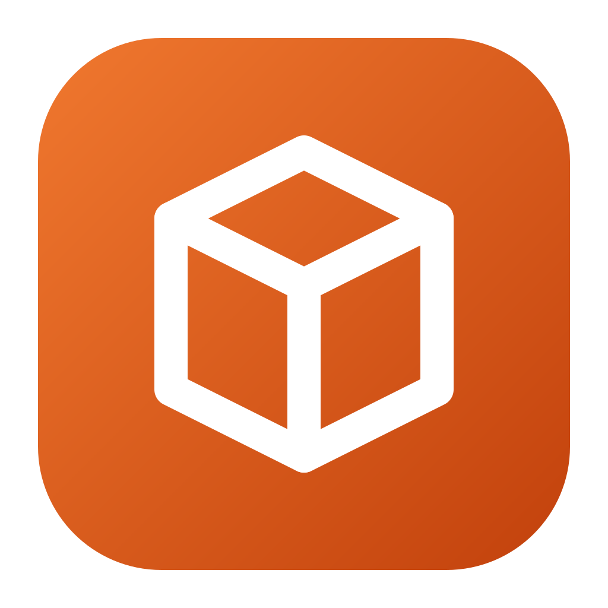
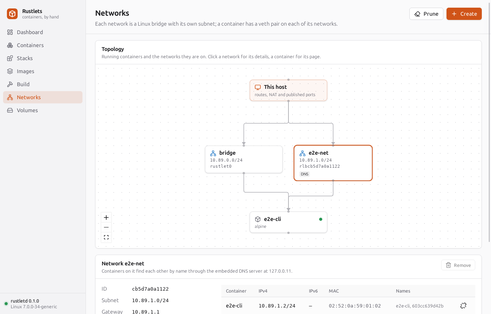
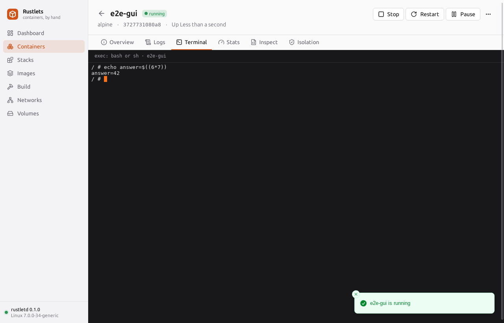
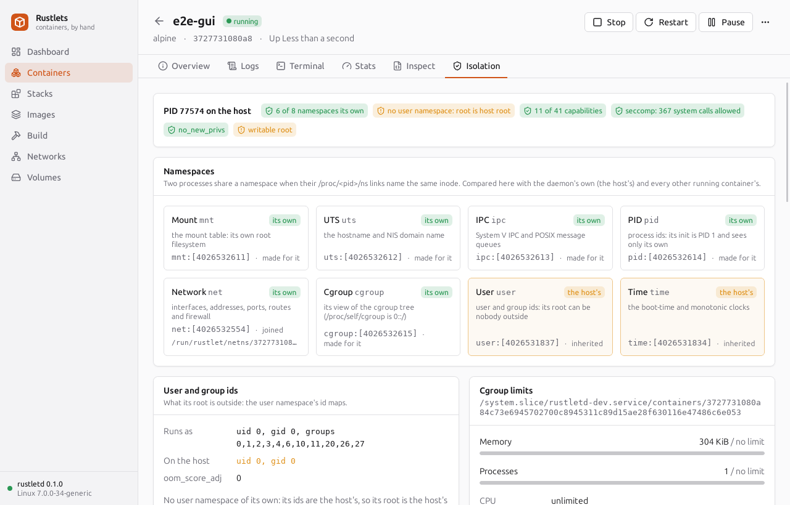
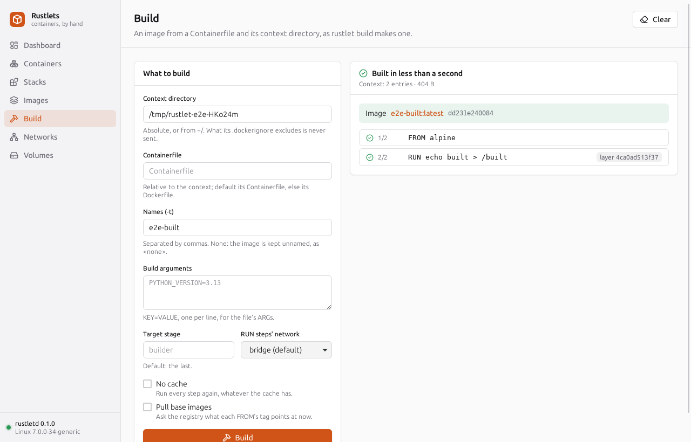
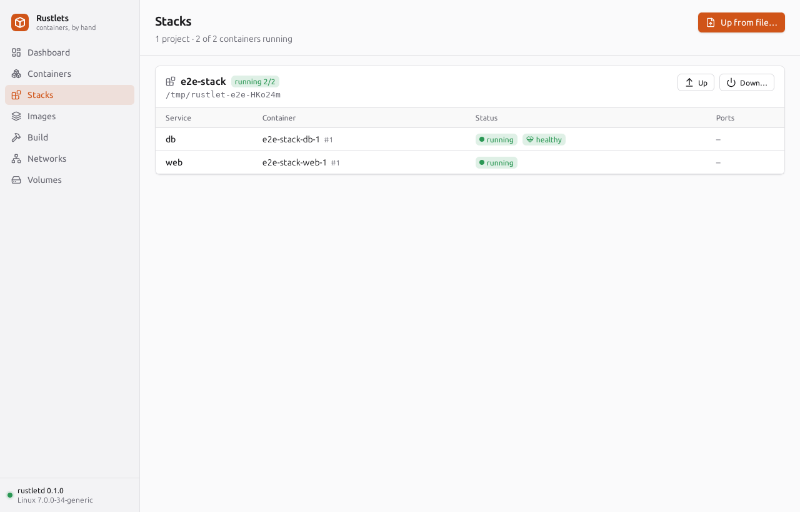
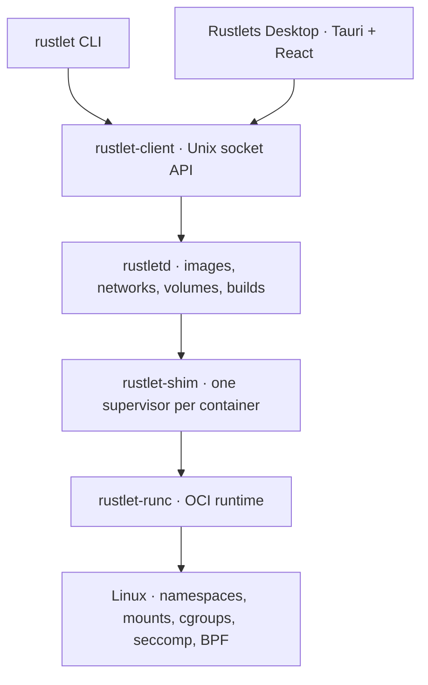

# Rustlets

**Containers, by hand.**

Rustlets is a Linux container engine written in Rust, with its own OCI runtime,
daemon, CLI, and desktop app. Pull and run images, build Containerfiles, bring up
Compose applications, and see what the kernel actually isolates.

The project pairs a working container stack with **20 learning chapters** that
explain its implementation, from `clone3` and `pivot_root` to DNS and the desktop
terminal. The CLI and GUI manage the same containers and stay in sync through
live daemon events.

[Get started](#get-started) · [Desktop tour](#desktop-tour) ·
[Build and compose](#build-and-compose) · [How it works](#how-it-works) ·
[Learn the internals](#learn-the-internals)



*The Networks view shows bridges, subnets, and container connections. Click a
network or container to inspect it. Screenshots use demonstration fixtures from
the project's GUI lifecycle checks.*

## What you can do

| Feature | What it gives you |
|---|---|
| Containers | Interactive shells, background services, logs, exec, pause/resume, restart policies, and live resource stats |
| Images | OCI registry pulls, tagging, container commits, and image archive save/load |
| Builds | Containerfile/Dockerfile builds, multi-stage builds, build arguments, `.dockerignore`, and a layer cache |
| Compose | Applications with dependency ordering, healthchecks, profiles, networks, and persistent volumes |
| Networking | Published TCP/UDP ports, bridge networks with DNS, several networks per container, and IPv6 on user-defined networks |
| Storage | Named and anonymous volumes, bind mounts, tmpfs, and OverlayFS image layers |
| Desktop | Container management, terminals, charts, an isolation inspector, image builds, and Compose stacks |
| Runtime | Linux namespaces, cgroups v2, capability controls, seccomp, eBPF device filtering, and optional user namespace remapping |

Phases 0–7 are implemented and reviewed. This version runs on **x86_64 Linux
with a rootful daemon**. Rootless operation and Docker API compatibility are
planned; see [current limits](#current-limits) before porting an existing setup.

## Get started

### 1. Prepare your host

| Requirement | Supported setup |
|---|---|
| OS | x86_64 Linux; development and verification use Linux Mint / Ubuntu 24.04 |
| Kernel | Linux 6.8 or newer, with unified cgroups v2 |
| Service manager | systemd 254 or newer, for delegated container cgroups |
| Storage | A local filesystem suitable for OverlayFS; ext4 is the tested setup |
| Rust | Current stable Rust; the desktop crate requires Rust 1.90 or newer |
| Desktop toolchain | Node 24 and pnpm 12.6.0, if you want the GUI |

With Rust installed, run these commands from the repository root. On Ubuntu
24.04 / Mint 22.x, install the CLI and daemon's system prerequisites:

```sh
sudo apt update
sudo apt install build-essential pkg-config git curl ca-certificates nftables iproute2

rustup update stable
rustup component add clippy rustfmt
```

### 2. Install the daemon and CLI

Create the socket access group and add your normal user before starting the
service:

```sh
getent group rustlet >/dev/null || sudo groupadd --system rustlet
sudo usermod -aG rustlet "$USER"
cargo xtask daemon install --release --enable
```

The installer builds as your user, then uses `sudo` to install `rustlet`,
`rustletd`, `rustlet-shim`, and `rustlet-runc` into `/usr/local/bin`. It installs
and starts `rustletd.service`; `--enable` also starts it at boot. Build with
ordinary `cargo`, including when installing the service.

**Log out and back in**, including your desktop session, so the new group
membership takes effect. The `rustlet` group grants root-equivalent daemon
access; add only trusted accounts.

### 3. Run your first container

```sh
rustlet version
rustlet info
rustlet run --rm alpine echo "Hello from Rustlets"
rustlet run -it --rm alpine sh
```

Missing images are pulled automatically. Inside the Alpine shell, try
`hostname`, `ps`, or `cat /proc/self/cgroup`; use `exit` to leave it.
`--rm` removes the container when it exits.

Run a web server and inspect it:

```sh
rustlet run -d --name web -p 127.0.0.1:8080:80 nginx
curl http://127.0.0.1:8080
rustlet logs --tail 20 web
rustlet stats --no-stream web
rustlet exec -it web sh
```

The port binds to localhost. If the first request arrives before nginx is
ready, try it again. Exit the shell, then remove the example:

```sh
rustlet stop web
rustlet rm -v web
```

Use `rustlet --help` or `rustlet run --help` to explore the available commands
and options.

## Desktop tour

### Launch the app

Install the Linux desktop libraries, then build and run from `desktop/`:

```sh
sudo apt install libwebkit2gtk-4.1-dev libxdo-dev libssl-dev \
  libayatana-appindicator3-dev librsvg2-dev

npm install --global pnpm@12.6.0
cd desktop
pnpm install --frozen-lockfile
pnpm tauri dev
```

The app runs as your normal user and connects to the installed daemon. Start
with **Dashboard**, use **Images → Pull** or **Run a container**, then open a
container's page for its logs, terminal, charts, and isolation details. CLI
changes appear in the app without a reload.

### Open a shell

Select a running container and open **Terminal** to start an interactive shell.
This is an exec session inside that container, with terminal resizing and
keyboard input handled by the app.



### Inspect the isolation

Open **Isolation** to compare container namespaces with the host and inspect
capabilities, seccomp, cgroup limits, filesystem protections, and devices. The
view explains each mechanism and reads the running container's kernel state.



### Package the desktop app

From `desktop/`, create the Linux distribution packages:

```sh
pnpm tauri build
```

The `.deb` and AppImage are written under `target/release/bundle/` at the
repository root. They contain **the desktop app**; install the daemon and CLI
separately using the steps above. See the [desktop guide](desktop/README.md) for
development, stream behavior, and GUI testing.

## Build and compose

The bundled [hits example](examples/hits/) is a Python web app that counts
visits in Redis. Its [Containerfile](examples/hits/Containerfile) installs the
Redis client, adds the app, and defines a healthcheck.

From the repository root, build the image:

```sh
rustlet build -t hits-web examples/hits
```

Repeat the command to see the build cache in action. The desktop **Build** view
offers the same workflow: choose the context directory and image tag, then
follow each step and its output. Use an absolute path or `~/` for the context.



*A small demonstration build; the hits example uses the same workflow.*

Bring up the complete application:

```sh
rustlet compose -f examples/hits/compose.yaml up -d
rustlet compose -f examples/hits/compose.yaml ps
curl http://127.0.0.1:8000
curl http://127.0.0.1:8000
rustlet compose -f examples/hits/compose.yaml logs web
```

Compose starts Redis, waits for it to become healthy, then starts the web app.
Allow the web app a moment to start before the first request. The response is
`Hello from Rustlets! I have been seen 1 times.`; subsequent visits increment
the counter.

Open **Stacks** to see the project's services, health, and published ports.
**Up from file…** can also launch the example directly from its Compose file.



*A demonstration stack; the hits project appears here with `web` and `redis`.*

Stop and remove the application while keeping its Redis data:

```sh
rustlet compose -f examples/hits/compose.yaml down
```

Add `-v` to `down` when you also want to delete the example's named data volume.

## How it works



Containers keep running across daemon restarts because their shims supervise
them independently. The runtime implements the kernel setup itself, behind
safe syscall wrappers. Project `unsafe` code is confined to `rustlet-sys`;
the other crates forbid it.

| Directory | Purpose |
|---|---|
| [crates/](crates/) | Runtime, daemon, image/network/build/Compose libraries, API client, and CLI |
| [desktop/](desktop/) | Tauri Rust backend and React/TypeScript frontend |
| [tests/](tests/) | Privileged integration checks against real Linux mechanisms |
| [xtask/](xtask/) | Service installation, test fixtures, integration harness, and generated bindings |
| [examples/hits/](examples/hits/) | A runnable image-build and Compose demonstration |
| [docs/](docs/) | Architecture, learning chapters, and review reports |

## Learn the internals

The [architecture and roadmap](docs/architecture.md) describe the components,
implemented scope, and design choices. The [learning series](docs/learn/)
connects the source to experiments and recorded output:

| Start here | Follow the implementation |
|---|---|
| Linux foundations | [Namespaces](docs/learn/01-namespaces-intro.md), [mounts and pivot_root](docs/learn/02-mounts-pivot-root.md), [cgroups v2](docs/learn/04-cgroups-v2.md), [PTYs and descriptor passing](docs/learn/05-ptys-fd-passing.md) |
| Isolation | [Capabilities](docs/learn/06-capabilities.md), [seccomp BPF](docs/learn/07-seccomp-bpf.md), [user namespaces](docs/learn/09-user-namespaces.md), [eBPF device filtering](docs/learn/10-ebpf-devices.md) |
| Images and services | [OCI images](docs/learn/11-oci-images.md), [OverlayFS](docs/learn/12-overlayfs.md), [daemon and shim](docs/learn/13-daemon-shim-architecture.md) |
| Networking | [Bridges and netlink](docs/learn/14-veth-bridges-netlink.md), [NAT and nftables](docs/learn/15-nat-nftables.md), [DNS](docs/learn/16-dns.md) |
| Desktop and applications | [Tauri IPC](docs/learn/17-tauri-ipc.md), [building images](docs/learn/18-building-images.md), [Compose](docs/learn/19-compose.md) |

Chapters preserve their original experiments and phase history. Use this README
for current installation steps.

## Develop and verify

With the desktop system libraries installed, run from the repository root:

```sh
cargo install cargo-nextest --locked
cargo fmt --all --check
cargo clippy --workspace --all-targets -- -D warnings
cargo nextest run --workspace
cargo test --workspace --doc
cargo xtask gen-ts --check
```

For privileged integration tests, install `runc` and `strace`, generate the
test root filesystems, then run the delegated harness:

```sh
sudo apt install runc strace
cargo xtask rootfs --remap
cargo xtask itest
```

The harness builds as your user and runs tests through `sudo` in bounded
systemd scopes. Run integration, GUI, and smoke suites separately: some checks
compare the host's mount table.

From `desktop/`, check the frontend:

```sh
pnpm typecheck
pnpm test
pnpm build
```

The [completed project review](docs/reviews/project-2026-10-05.md) records
1,192 workspace test passes, 340 privileged/harness checks, 173 frontend tests,
19 GUI lifecycle steps, all 12 CLI smoke sections, and inspected desktop
packages. GUI test setup is in [desktop/README.md](desktop/README.md#end-to-end).

## Configuration and troubleshooting

| Setting | Default |
|---|---|
| API socket | `/run/rustlet/rustlet.sock` |
| Persistent images, volumes, and state | `/var/lib/rustlet` |
| Transient runtime state | `/run/rustlet` |
| Optional daemon configuration | `/etc/rustlet/daemon.toml` |

Both clients accept `RUSTLET_HOST` for a different socket; the CLI also has
`--host`. Use a socket path or `unix:///path`. Available daemon settings are
documented in [config.rs](crates/rustletd/src/config.rs).

If the daemon is unavailable or the app cannot connect, check its status,
logs, socket permissions, and your group membership:

```sh
systemctl status rustletd --no-pager
sudo journalctl -u rustletd -n 100 --no-pager
ls -l /run/rustlet/rustlet.sock
id -nG
```

After changing group membership, log back in. If you created the `rustlet`
group after starting the daemon, restart it with
`sudo systemctl restart rustletd` so it picks up the group.

## Current limits

Rustlets implements its own API and a supported subset of familiar container
workflows. In this version:

- The runtime and images target **Linux/amd64**. Rootless operation, registry
  push, and Docker API compatibility remain planned work.
- Registry pulls use anonymous access; there is no login or private-registry
  credential management.
- The builder supports classic Containerfile workflows. BuildKit heredocs,
  `RUN --mount` caches/secrets, and remote `ADD` are not implemented.
- Compose has no scaling, secrets/configs, or `extends`/`include`. Supported
  fields and remaining omissions are documented in the architecture and
  [Compose chapter](docs/learn/19-compose.md).

## License

The workspace declares **Apache-2.0** in [Cargo.toml](Cargo.toml). Vendored
security profile provenance and licensing are recorded in
[profiles/README.md](profiles/README.md).
