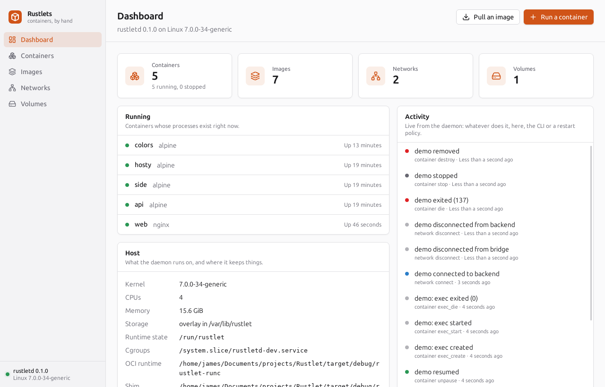
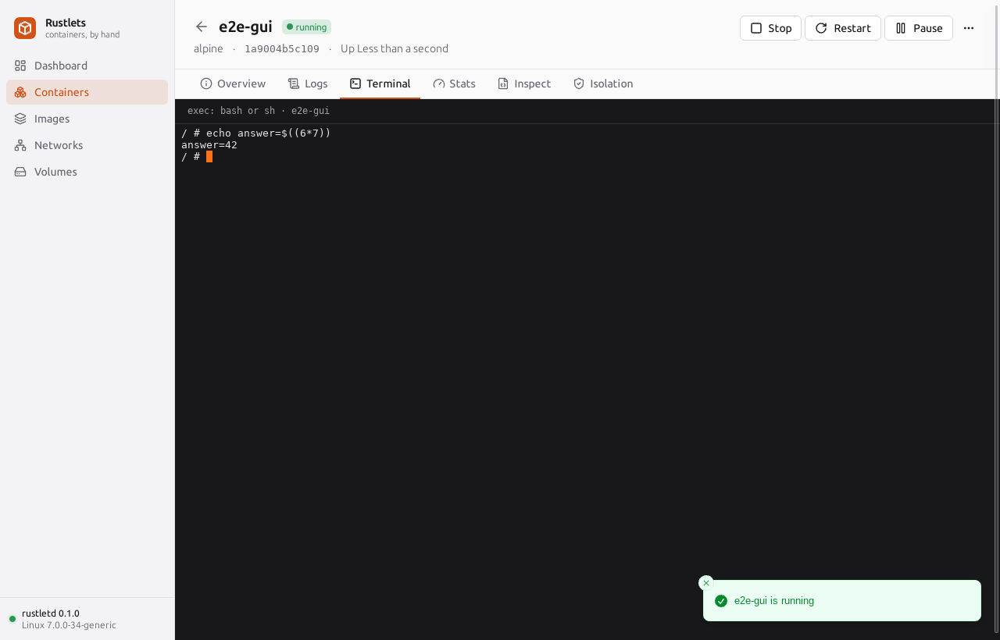
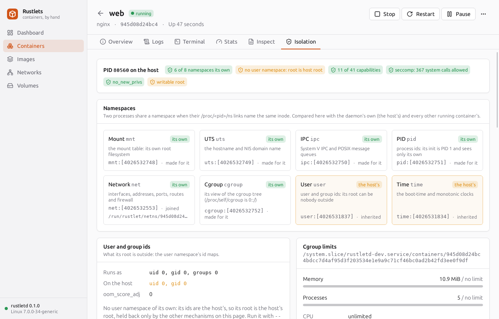
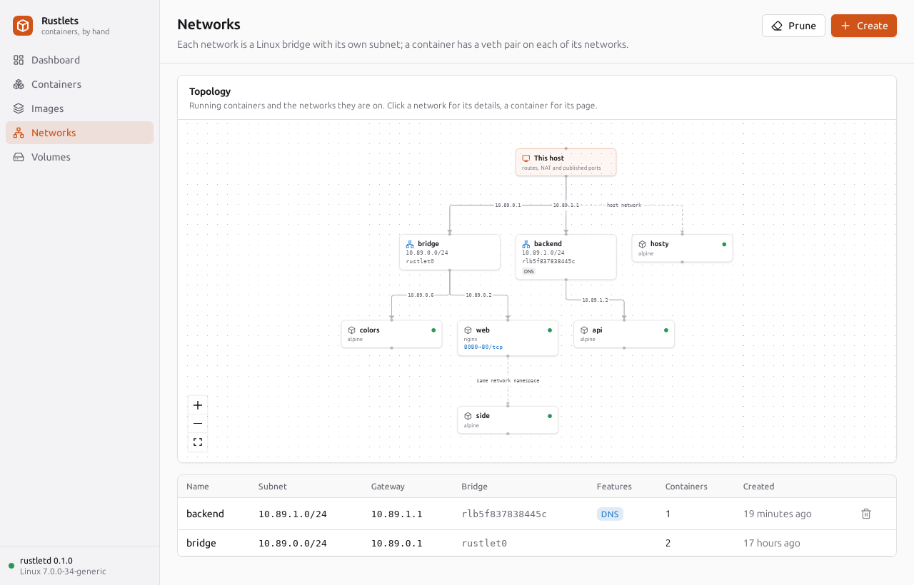

# 17 — Tauri IPC: a desktop app over the daemon's API

Sixteen chapters built a container engine you drive from a terminal. This
one puts a window on it: Rustlets Desktop, a Tauri v2 app with a React
frontend, where you run containers, read their logs, open a shell in them,
watch their CPU and memory, see which networks they sit on, and look at
what actually isolates each one from the host. The interesting part isn't
the buttons. It is how a click in a web page becomes a call on a Unix
socket that only the daemon listens on, how a stream of log lines or
terminal bytes gets back into the page, how the page stays true while the
CLI changes things behind its back, and what keeps the page from doing
anything else.

Code: [`desktop/src-tauri/src`](../../desktop/src-tauri/src) (`lib.rs` the
app, `commands.rs` the commands, `streams.rs` channels and the daemon
watch, `terminal.rs` exec sessions, `error.rs`), [`build.rs`](../../desktop/src-tauri/build.rs)
and [`capabilities/main.json`](../../desktop/src-tauri/capabilities/main.json)
(permissions), [`desktop/src/lib`](../../desktop/src/lib) (`ipc.ts` every
command typed, `events.ts` events to stale queries, `daemon.tsx` the
connection, `terminal.ts`, `stats.ts`, `ansi.ts`, `pull.ts`,
`topology.ts`), the views in [`desktop/src/views`](../../desktop/src/views);
type generation in [`xtask/src/gents.rs`](../../xtask/src/gents.rs) and
`rustlet_spec::export_typescript`; on the daemon's side
[`isolation.rs`](../../crates/rustletd/src/isolation.rs), the `hangup`
control ([`attach.rs`](../../crates/rustletd/src/attach.rs) `bridge`, the
shim's [`reaper.rs`](../../crates/rustlet-shim/src/reaper.rs) `signal`).
Tests: 74 Vitest tests (the logic in `desktop/src/lib/*.test.ts`, the
views in `desktop/src/**/*.test.tsx`), 11 Rust tests in `rustlet-desktop`,
`dm_isolation_report`, `dm_exec_hangup` and
`dm_events_for_changes_without_an_exit` in
[`daemon.rs`](../../tests/tests/daemon.rs),
`dn_events_and_summaries_for_the_desktop_app` in
[`daemon_network.rs`](../../tests/tests/daemon_network.rs), and the end-to-end scenario
[`desktop/e2e/lifecycle.mjs`](../../desktop/e2e/lifecycle.mjs). Design:
[architecture.md §2.8](../architecture.md#28-rustlets-desktop-tauri-v2--reactts).

The transcripts were recorded on 2026-10-02 (§5's stream and §9's run
again on 2026-10-03, after the phase's review) with a debug build of the app
on a private Xvfb display (§9 says why), against a daemon of the same
build run as a transient unit with its socket in the user's group, on
kernel 7.0.0-34-generic. Tauri is 2.12.1, WebKitGTK 2.52.6.

## 1. A window, three processes, and no socket

A Tauri app is a native program that opens a window and fills it with
the system's web engine; on Linux that is WebKitGTK. Unlike Electron, it
ships no browser of its own, which is why the whole `.deb` is 4.5 MiB.
WebKit itself is several processes. With the app running:

```console
$ ps -o pid,ppid,rss,comm --ppid $(pgrep -x rustlets-deskto) -p $(pgrep -x rustlets-deskto)
    PID    PPID   RSS COMMAND
  78796   78782 194836 rustlets-deskto
  78819   78796 49776 WebKitNetworkPr
  78847   78796 388516 WebKitWebProces
```

`rustlets-desktop` is our Rust: the GTK main loop, the window, a Tokio
runtime, and `rustlet-client`. `WebKitWebProcess` runs the page: our
React app, its JavaScript, layout and painting. `WebKitNetworkProcess`
loads what the page asks for. The page itself is served by the Rust
process from assets compiled into the binary (`tauri::generate_context!`
embeds `desktop/dist`), over a URI scheme of Tauri's; in development it
comes from Vite's dev server instead, with hot reloading.

The page cannot talk to the daemon. A web page has `fetch` and
WebSockets over TCP, not Unix sockets, and even if it had them, the
socket is root's (or the `rustlet` group's, which is the same thing:
whoever can create a container can mount the host's `/` into one). So
everything goes through the Rust process:

```text
  ┌──────────── WebKitWebProcess ─────────────┐
  │ React: <Button onClick={stop}>            │
  │   invoke("container_stop", {id: "web"})   │      (§2)
  └───────────────────┬───────────────────────┘
                      │ fetch("ipc://localhost/container_stop", POST, JSON)
  ┌───────────────────▼──── rustlets-desktop ─┐
  │ the ACL: may this window call it?         │      (§4)
  │ commands::container_stop(app, id)         │
  │   app.client.stop(&id, None)              │
  └───────────────────┬───────────────────────┘
                      │ POST /v1/containers/web/stop, HTTP/1.1 on the Unix socket
  ┌───────────────────▼──── rustletd ─────────┐
  │ stop signal, wait, KILL; the exit; events │ ──► NDJSON /v1/events ──► every client (§6)
  └───────────────────┬───────────────────────┘
                      │ frames on shim.sock
                 rustlet-shim → rustlet-runc kill → the kernel
```

The Rust side is small on purpose. `commands.rs` has one function per API
call, each a wrapper over the client of chapter 13: the API's own types
in, the API's own types out. The few others are the app's own (the socket
it uses, starting the service, the run dialog's `-p`/`-v` parsing,
cancelling a stream, a terminal's input, size and close). All the policy
(what a stop means, what a restart policy does) stays in the daemon, so
the window and the CLI can't disagree about it.

## 2. A command, end to end

On the TypeScript side a command is a promise:

```ts
// desktop/src/lib/ipc.ts
stop: (id: string, timeout?: number) => call<void>("container_stop", { id, timeout }),
```

`call` wraps `invoke` from `@tauri-apps/api/core`, which hands the call to
`window.__TAURI_INTERNALS__`, a script Tauri injects into every page. On
Linux that script turns the call into a request on a custom URI scheme
(`scripts/ipc-protocol.js` in the `tauri` crate):

```js
fetch(window.__TAURI_INTERNALS__.convertFileSrc(cmd, 'ipc'), {   // ipc://localhost/container_stop
  method: 'POST',
  body: data,                       // the arguments, JSON
  headers                           // Tauri-Callback, Tauri-Error, Tauri-Invoke-Key
})
```

The page registered two callbacks, success and failure, under numeric
ids, and sent their ids along; the response's `Tauri-Response: ok` or
`error` header says which to run, and its content type whether the body
is JSON, text or bytes. If the custom scheme fails (a strict policy
blocked it), the script falls back to `window.ipc.postMessage`, a WebKit
message handler. The `Tauri-Invoke-Key` is a random key baked into the
injected script at startup, so a request that didn't come from the app's
own page (an iframe of something else, say) is refused.

WebKit hands the request to wry, wry to Tauri, and Tauri, after the key,
the origin and the permission check of §4, looks the name up in the
`match` that `tauri::generate_handler!` built from our function names. The
arguments are deserialized one by one, by name, from the JSON object:

```rust
#[tauri::command(rename_all = "snake_case")]
pub async fn container_stop(app: S<'_>, id: String, timeout: Option<u32>) -> CommandResult<()> {
    Ok(app.client.stop(&id, timeout).await?)
}
```

`app` isn't in the JSON: a `State` argument is the value registered with
`Builder::manage`. Tauri's default would expect camelCase names from
JavaScript (`containerId`); `rename_all = "snake_case"` keeps the API's
names on both sides. The result is serialized back; an `Err` becomes the
rejection. Here are four calls made from the page, through WebDriver, with
what each promise settled to:

```text
invoke("daemon_version")
{ "ok": { "arch": "x86_64", "api_version": "v1", "os": "linux",
          "kernel": "7.0.0-34-generic", "version": "0.1.0" } }

invoke("container_inspect", {id: "nope"})
{ "err": { "kind": "no_such_container", "message": "no such container: nope" } }

invoke("plugin:window|set_title", {label: "main", value: "pwned"})
{ "err": "window.set_title not allowed. Permissions associated with this command: core:window:allow-set-title" }

invoke("no_such_command")
{ "err": "no_such_command not allowed. Command not found" }
```

The second is our error type (`error.rs`): `kind` is the daemon's
`ErrorKind` as the API spells it; or `unreachable` (nothing listens on
the socket) or `denied` (the socket isn't this user's), which `error.rs`
tells apart by the `io::ErrorKind` of the failed `connect()` inside the
client's error; or `invalid` (the run dialog's `-p`/`-v` values) or
`failed` (anything else: a broken connection, a protocol error). The
frontend acts on the kind: `no_such_image` makes the run dialog pull and
try again, as `rustlet run` does; `unreachable` shows "Start rustletd".
The last two are Tauri's own refusals, which §4 explains. (A release
build says less: `Command … not allowed by ACL`, without the permission
to ask for.)

**Where a command runs.** An `async` command is spawned on Tauri's Tokio
runtime, its arguments deserialized there too; a plain `fn` runs on the
main thread, GTK's, before the reply.
That difference cost a crash. `daemon_watch` (§6) is a plain `fn` that
starts a task, and the task was started with `tokio::spawn`. The first
time the app ran:

```text
thread 'main' panicked at desktop/src-tauri/src/streams.rs:89:22:
there is no reactor running, must be called from the context of a Tokio 1.x runtime
```

`tokio::spawn` finds its runtime through a thread-local that only the
runtime's own threads (and code it is running) have set, and GTK's
thread is neither. `tauri::async_runtime::spawn` goes through a handle to
Tauri's runtime that works from any thread. The unit tests hadn't caught
it, because `#[tokio::test]` runs every test inside a runtime;
`streams_start_outside_a_runtime` now spawns from a plain `#[test]`, and
fails with `tokio::spawn` back.

The page's Content Security Policy (`tauri.conf.json`) has
`connect-src ipc: http://ipc.localhost`: the IPC is a `fetch`, so the
policy has to allow it, and it allows nothing else to be fetched.

## 3. One set of types

The daemon's request and response bodies are Rust structs in
`rustlet-spec` (chapter 13). The frontend needs the same shapes in
TypeScript, and writing them twice would make every renamed field a bug
that compiles. So each struct derives `ts_rs::TS` next to serde's
traits, and `cargo xtask gen-ts` writes `desktop/src/bindings/`, one
declaration per type, the Rust doc comments carried over as JSDoc:

```ts
// desktop/src/bindings/PullEvent.ts (excerpt)
export type PullEvent = { "status": "resolving", reference: string, }
  | { "status": "downloading", kind: BlobKind, digest: string, current: number, total: number, }
  | { "status": "unpacked", chain_id: string, entries: number, bytes: number, … }
  | …                                         // resolved, exists, downloaded, done, layer_exists, unpacking
  | { "status": "ready", reference: string, manifest: string, }
  | { "status": "error", message: string, };
```

`#[serde(tag = "status")]` became a discriminated union: in
`lib/pull.ts`, `switch (e.status)` narrows `e` in each branch, and a
status added in Rust without a case here fails the type check. Three
choices in the generator:

- **`u64` is `number`.** ts-rs makes it `bigint` by default, which is
  right for values above 2^53, but `JSON.parse` gives numbers, so the
  type would lie. Every size and counter the API sends is far below 2^53.
- **Serde's renames count.** `MountPoint` has a Rust field `kind` that
  serde renames to `type`. The overview tab first said `m.kind`, and the
  type checker refused it before the app ever ran.
- **Requests are partial.** Every struct takes missing fields as their
  defaults (`#[serde(default)]`), so the run dialog sends
  `Partial<ContainerConfig> & { image: string }`, only what the user set,
  and the daemon fills the rest exactly as for the CLI.

The files are committed, so the frontend builds without Rust, and CI runs
`cargo xtask gen-ts --check`, which generates them again into a scratch
directory and fails on any difference. The few types the desktop crate
defines itself (`CommandError`, the channel messages of §5 and §6) are
written out by hand in `src/lib/ipc.ts`. Rust tests pin the JSON the Rust
side sends (`daemon_messages_are_tagged`, `messages_are_tagged`), so a
change there fails a test that points at `ipc.ts`; nothing checks the
TypeScript copy itself.

## 4. What the page may call

Tauri 2 checks every call against an access-control list. Each command
has permissions (`allow-…`, `deny-…`), and a **capability** grants a set
of permissions to a set of windows. For the app's own commands the
permissions are generated: `build.rs` lists them,

```rust
const COMMANDS: &[&str] = &["daemon_socket", "daemon_version", …, "volume_prune"];
tauri_build::try_build(tauri_build::Attributes::new()
    .app_manifest(tauri_build::AppManifest::new().commands(COMMANDS)))
```

and the build writes a file per command:

```toml
# permissions/autogenerated/container_stop.toml
[[permission]]
identifier = "allow-container-stop"
description = "Enables the container_stop command without any pre-configured scope."
commands.allow = ["container_stop"]
```

Once an app declares its commands this way, a command no capability
grants is refused. `capabilities/main.json` grants the `main` window
exactly the 40 commands and `core:default`: the default sets of Tauri's
core plugins. For the window, the webview and the app those are getters;
but they also let the page emit and listen to events, resolve paths, and
use the menu, tray and image APIs (creating a menu, setting a tray icon,
loading an image from a path). None of them reaches the daemon. The
build checks the capability: a misspelt permission fails `cargo build`,
not the app. That is what refused `window.set_title` in §2: it is a core
command, but `core:default` doesn't include changing the title. And
nothing grants the filesystem, the shell or HTTP plugins, which this app
doesn't even link.

Why care, when the page is our own code? Because a page renders what it
is given. A container's log line, an image's labels, a network's name: if
any of them ever reached the page as HTML instead of text, a script in it
would run with every permission the window has. React escapes text, and
the log view turns ANSI escapes into styled spans, never into markup; the
permission list is the second wall. The real boundary stays the
daemon's socket: the app runs as the desktop user, so a user who may not
use the daemon gets `denied` and a page explaining the `rustlet` group,
never more power through the GUI. (`denied` can also mean a stopped
daemon: `connect()` fails with `EACCES` on a run directory that is still
root's alone, before it could find that there is no socket, so that page
offers to start the daemon too.)

## 5. Streams over channels

`invoke` is one request, one answer. Logs, stats, pull progress and
terminal output are streams, and they use **channels**. On the page a
channel is a callback registered under a number; passed as an argument,
it serializes to the string `"__CHANNEL__:<id>"`. On the Rust side that
argument deserializes to a `tauri::ipc::Channel<T>`, and every
`channel.send(value)` runs the page's callback with
`{message: value, index: n}`. Delivery depends on size: JSON under 8 KiB
and bytes under 1 KiB are written straight into a JavaScript call the
webview evaluates; anything larger is queued in the Rust process and the
page fetches it with the internal command `plugin:__TAURI_CHANNEL__|fetch`.
The two paths can overtake each other, which is what the index is for:
the page delivers messages in index order and holds back any that arrive
early. When the last Rust clone of the channel is dropped, the page gets
`{end: true}` and forgets the callback.

Here is a whole stream, made by hand in the page (a callback id from
`transformCallback`, passed as `"__CHANNEL__:" + id`): the last three
lines of a container's log, without `follow`:

```json
{ "returned": 2,
  "messages": [
    { "index": 0, "message": { "type": "items", "items": [
        { "stream": "stdout", "ts": "2026-10-03T07:15:32.151529917Z",
          "log": "\u001b[1;31mERROR\u001b[0m connection refused\n" },
        { "stream": "stdout", "ts": "2026-10-03T07:15:32.151565638Z",
          "log": "\u001b[32mok\u001b[0m retrying\n" },
        { "stream": "stderr", "ts": "2026-10-03T07:15:32.151588669Z",
          "log": "to stderr\n" } ] } },
    { "index": 1, "message": { "type": "end" } },
    { "end": true, "index": 2 } ] }
```

`returned: 2` is the command's own result, the stream's id. Messages 0
and 1 are ours (`StreamMessage` in `streams.rs`: `items`, then `end` or
`error`); message 2 is Tauri's, sent when the forwarding task finished and
dropped the channel. The three lines came in one message: they arrived
within 10 ms of each other (batching, below).

**How a stream starts and stops.** `container_logs` asks the client for
the logs first, so an error the daemon gives before streaming (no such
container) rejects the `invoke` itself; only a stream that has started
gets an id. Then it hands the `JsonStream` and the channel to
`Streams::spawn`, which keeps the task's `AbortHandle` under that id. When
the view goes away, the page calls `stream_cancel(id)`: the task is
aborted, the `JsonStream` is dropped, its connection closes (chapter 13:
one connection per request, so hanging up *is* the cancellation), and the
daemon's handler, whose next write fails, stops reading the log. A page
that reloads cancels everything the previous page had open
(`Builder::on_page_load`); otherwise its streams would run on for nobody.

React complicates the page side in a small way: in development it mounts
every component twice, to flush out effects that don't clean up. The
second mount starts a second stream before the first `invoke` has even
returned its id. So every stream-opening effect keeps a `closed` flag,
and an id that arrives after its cleanup is cancelled at once.

**Batching.** Each channel message is a JavaScript call in the webview,
and on the page each is a React state update, so a re-render. The first
version sent each item as it came, adding only what had *already*
arrived (`now_or_never`) to the same message, with no timer. Measured
on a container that prints a line now and then (591 lines then; 691 by
the second measurement, as it went on printing): 436 messages for 591
lines. The daemon writes a line at a time,
more slowly than the app reads them, so there was rarely more than one
waiting. Now a batch collects what arrives within 10 ms of its first item
(`BATCH_WINDOW`, up to 512 items):

```text
before:  {"items":591, "messages":436, "ms":126}
after:   {"items":691, "messages":4,   "ms":59}
```

The whole log also arrived twice as fast: fewer calls and renders left
more time for reading. A lone item now waits up to 10 ms, which nobody
sees in a log or a chart. The terminal's output (§7) is the exception: a
keystroke's echo should show at once, so it is never batched.
`what_arrives_within_the_window_goes_together` checks the window with
Tokio's paused clock: four items 2 ms apart make one message.

## 6. Staying in sync with everything else

The window is not the only client. The CLI, a restart policy, or a
container that exits on its own change the daemon's state too, and the
milestone of this phase is that the window shows it, at once, without a
refresh button. The daemon already tells everyone: `GET /v1/events`
(chapter 13) streams a JSON line per change.

```console
$ curl -sN --unix-socket /run/rustlet/rustlet.sock http://rustletd/v1/events
{"time":"…T01:11:13.470785216Z","kind":"container","action":"pause","id":"2b618fb7f85f…","attributes":{"image":"alpine","name":"colors"}}
{"time":"…T01:11:13.481196191Z","kind":"container","action":"unpause","id":"2b618fb7f85f…","attributes":{"image":"alpine","name":"colors"}}
{"time":"…T01:11:13.486769154Z","kind":"container","action":"exec_create","id":"2b618fb7f85f…","attributes":{"exec_id":"b8e3…","name":"colors"}}
{"time":"…T01:11:13.538815832Z","kind":"container","action":"exec_start","id":"2b618fb7f85f…","attributes":{"exec_id":"b8e3…","name":"colors"}}
{"time":"…T01:11:13.539180811Z","kind":"container","action":"exec_die","id":"2b618fb7f85f…","attributes":{"exec_id":"b8e3…","exit_code":"0","name":"colors"}}
```

That was `rustlet pause colors; rustlet unpause colors; rustlet exec
colors true` in another terminal.

The app opens one such stream for its whole life (`watch_daemon`, the
`daemon_watch` command) and keeps it open: if the connection fails or
ends, it waits (250 ms, doubling to 4 s) and connects again. It sends the
page three kinds of message: `connected` (with the daemon's version: the
sidebar's green dot), `disconnected` (with the error: the red dot and
"Start rustletd"; sent when the reason changes, not on every retry), and
`events`, batched as in §5.

On the page, every piece of daemon state a view shows is a TanStack Query
query with a key: `["containers", {all: true}]`, `["container", "web"]`,
`["networks"]`. The cache serves what it has and refetches what is
*stale*. `lib/events.ts` decides, for each event, which keys it can have
made stale. (TanStack also counts data older than five seconds as stale
when a view mounts or the window regains focus, `staleTime` in
`main.tsx`: a second chance, not a poll.)

| event | stale |
|---|---|
| a container's `start`, `die`, `stop`, `kill`, `pause`, `unpause`, `restart`, `oom` | container lists and pages, the counts, networks (addresses come and go with a run), the isolation reports |
| a container's `create`, `destroy` | the above, and images and volumes (what uses them) |
| `exec_*` | nothing (no view lists execs) |
| an image's | image lists and pages, the counts |
| a network's `connect`, `disconnect` (running or not) | networks, container lists and pages, the isolation reports |
| a network's `create`, `destroy`; a volume's | their lists and pages, the counts |
| a kind this app doesn't know | everything |

The rules are coarse on purpose. Refetching a list over a Unix socket
costs a few milliseconds, and a refetch too few shows something false.
Two details keep them simple: an event names a container by its full id,
but its page may have been opened by name, so details are invalidated by
prefix (`["container"]` matches every `["container", x]`); and a burst
(`rm -f` of ten containers) refetches each key once per batch of events
(what arrived within 10 ms), not once per event. Queries on screen
refetch at once; the rest are only marked, and refetch when shown.
`connected` invalidates everything: whatever happened while the app wasn't
listening (a daemon restart empties the daemon's event history too) is
picked up by refetching.

How fast is "at once"? A `MutationObserver` in the page noted when the
containers list's row changed state, while the CLI paused and resumed the
container:

```text
┌─────────┬───────────┬────────┬───────────────────────────┬──────────┐
│ (index) │ action    │ cli_ms │ gui_after_cli_returned_ms │ total_ms │
├─────────┼───────────┼────────┼───────────────────────────┼──────────┤
│ 0       │ 'pause'   │ 29     │ 33                        │ 62       │
│ 1       │ 'unpause' │ 19     │ 30                        │ 49       │
│ 2       │ 'pause'   │ 32     │ 16                        │ 48       │
│ 3       │ 'unpause' │ 17     │ 26                        │ 43       │
│ 4       │ 'pause'   │ 26     │ 21                        │ 47       │
│ 5       │ 'unpause' │ 19     │ 34                        │ 53       │
└─────────┴───────────┴────────┴───────────────────────────┴──────────┘
```

16 to 34 ms after the CLI returned: the event, the batch window, the
channel, the invalidation, a refetch of the list over the socket, and a
render. The dashboard's activity feed is the same stream, shown as text.



## 7. A terminal, byte by byte

The terminal tab runs a shell in the container (`rustlet exec -it`) and
draws it with xterm.js, a terminal emulator written for browsers. Bytes
travel the whole way; nothing is a string until xterm.js decodes it:

```text
 keystroke → xterm.js onData("l") → TerminalInput (UTF-8) → invoke("terminal_input", {session, data: [108]})
   → SessionSender::send_stdin → WebSocket binary [0]"l" → rustletd → shim frame Stdin
   → write(PTY master) → the line discipline echoes it → the shell reads it

 the shell writes → PTY slave → read(PTY master) in the shim → frame Stdout
   → rustletd → WebSocket binary [1]bytes → SessionEvent::Stdout → Channel: InvokeResponseBody::Raw
   → the page gets an ArrayBuffer → xterm.write(new Uint8Array(…))
```

The first message of a busybox shell, caught on its channel:

```json
{ "returned": 1, "messages": [ { "index": 0, "message": { "bytes": 8, "text": "/ # \u001b[6n" } } ] }
```

Eight bytes: the prompt, then `ESC [ 6 n`, a *Device Status Report*: the
shell asks the terminal where its cursor is. xterm.js answers by typing
`ESC [ row ; col R`, through `onData` like a keystroke, so the answer
goes back into the container as input, exactly as a real terminal's
would. Output is sent as bytes (`InvokeResponseBody::Raw` on the Rust
side, an `ArrayBuffer` on the page) rather than text because a read can
end in the middle of a UTF-8 character; xterm.js's decoder keeps the
half for the next chunk, which a `String` conversion per chunk would have
turned into U+FFFD. The session's end comes on the same channel as JSON
(`{"type":"exit","code":0}`): one channel can carry both.

Input is bytes too, for a reason of its own. xterm.js reports what is
typed as a JavaScript string (`onData`), which `TerminalInput` encodes as
UTF-8. But a program that asks for mouse reports in the old X10 encoding
gets a byte per coordinate, column + 32, and xterm.js hands those over
through `onBinary`, as a string of one character per *byte*. Sent as
text, a click in column 130 (byte `0xA2`) became `0xC2 0xA2` on the way;
so `terminal_input` takes a list of bytes, and `onBinary`'s characters
go into it one byte each.

**Input in order.** Tauri may run two calls of an async command at the
same time, on different threads, so two keystrokes sent back to back
could reach the container swapped. `TerminalInput` (`lib/terminal.ts`)
keeps one `terminal_input` in flight; what is typed meanwhile is joined
into the next call. A paste of a thousand characters is one call; fast
typing, a few.

**Size.** The session starts with the terminal's size
(`ExecConfig.console_size`), so the shell's first prompt already knows
its width; after that `onResize` (from xterm.js's fit addon, which
measures the element) sends `resize`, which the shim turns into
`TIOCSWINSZ` on the PTY and the kernel into `SIGWINCH` for the shell.

**Hanging up.** In Docker, a client that leaves an exec session detaches:
the process runs on. For a GUI that would leak a shell every time a tab
closed. A real terminal does something else when its window closes: the
kernel sends the session's shell `SIGHUP`. So the WebSocket framing got a
client control, `hangup`. In an exec session the daemon forwards it to
the shim as a `Kill` request with `SIGHUP`, and the shim signals the
exec's process, but only through its reaper (chapter 13), and only if the
reaper is still waiting for that pid. That check is what makes it safe: a
child that has exited but isn't reaped is a zombie and keeps its pid, and
the reaper removes a waiter in the same step as it reaps, on the shim's
one thread, so a signal can never reach a process that inherited a reused
pid. In an attach session `hangup` means nothing: the container's own
process isn't the client's to hang up. The app hangs up and closes the
socket at once; the daemon then still waits, up to five seconds, for the
exit the signal brings, so that it is recorded (`exec inspect`, an
`exec_die` event) though nobody is there to hear it. `dm_exec_hangup` runs
an interactive `sh`, hangs up, and expects 129 (128 + `SIGHUP`), then one
that traps `SIGHUP`, prints, and exits 3 after its client has left; the
end-to-end scenario checks, from the CLI, that the container's `ps`
shows the shell while the tab is open and not after.

Quitting the app hangs up every terminal it has open, the same way: on
Tauri's `RunEvent::Exit` (the last window closed), and on `SIGTERM`,
`SIGINT` and `SIGHUP`, which the app turns into that exit (a logout sends
`SIGTERM`). Without it, the process would end, its sockets would close,
the daemon would take that for a detach, and a shell per open tab would
run on. The scenario's last step quits the app with `SIGTERM` and looks
for the shell again.

The shell itself is `sh -c 'if command -v bash >/dev/null 2>&1; then exec
bash; fi; exec sh'`, with `TERM=xterm-256color`: bash where the image has
it, sh otherwise.



## 8. The isolation inspector

Chapters 01 to 10 built the walls; the inspector shows them, for one
running container, as the kernel enforces them. The daemon serves it
(`GET /v1/containers/{id}/isolation`, `isolation.rs`), because only root
can read another user's namespace links, and it reads three places:

- `/proc/<pid>` of the container's init: the inode behind each
  `ns/<kind>` link (`net:[4026532552]`), the five capability masks and
  `NoNewPrivs`, `Seccomp` and `Seccomp_filters` of `status`, the ids as
  the host sees them, `uid_map`/`gid_map` (through which they are mapped
  back to the ids the container sees), `oom_score_adj`;
- the run's `config.json`: which namespaces were made, which joined (and
  from where), the seccomp profile (summarized: default action, the calls
  allowed outright and with conditions), masked and read-only paths,
  mounts, and the device filter's rules exactly as
  `DeviceFilter::build` compiles them (chapter 10: the configuration's,
  then the runtime's defaults, then `m` for the nodes init creates);
- the cgroup: limits beside usage.

Two processes share a namespace exactly when their links name the same
inode, so the report compares each with the daemon's own (which are the
host's) and with every other running container's: `--network
container:web` shows as "shared with web" on both sides. The ids are the
process's own as it runs, not the user `config.json` named: an
entrypoint that drops to another user (`su-exec`, `gosu`) shows as that
user, inside and outside. (The first version took "inside" from
`config.json` and "outside" from `status`, and for such a process
reported uid 0 inside and 1065534 outside: a mapping that doesn't
exist. `dm_isolation_report` now runs one.) The pid comes
from the container's state, so before reading anything the report checks
that `/proc/<pid>/cgroup` names the container's cgroup; a pid the kernel
has handed to another process since an exit would describe that
process.



Its first run showed something nobody had looked for: nginx's init had
`oom_score_adj` -500. The service runs with `OOMScoreAdjust=-500`, so
that the kernel's OOM killer takes the daemon last; shims inherit that,
and the daemon never gave containers a value of their own, so they
inherited it too. Under memory pressure the kernel would kill the host's
ordinary processes before any container's. Docker gives containers 0, and
now so does Rustlets (`process.oomScoreAdj` in every spec; raising one's
own score needs no privilege). The test daemons now run with -500 as the
service does, and `dm_isolation_report` expects 0.

## 9. Testing a desktop app

Most of the app is logic that needs no window, and it is written as plain
functions so that it can be tested as such: the invalidation rules, the
pull progress reducer, the stats arithmetic (the CLI's own: CPU time over
wall time, memory without the inactive page cache), the ANSI parser, the
ordered input queue, the graph layout. Vitest runs them in Node, in about
a second. The views' behaviour (the run dialog's create, pull and start;
a tab's stream that must reopen after a daemon restart; a terminal's
input while its shell starts) is tested the same way, rendered in jsdom
with Tauri's `invoke` and channels mocked. The Rust side's tests build a `tauri::ipc::Channel` around a
closure that records what it is sent, so the forwarding, batching and
cancellation are tested without a webview.

The milestone needs the real thing: the built app, clicked through, while
the CLI acts. Browsers are driven through **WebDriver** (W3C), a JSON
protocol over HTTP: start a session, find an element, click it, read its
text, run a script, take a screenshot. WebKitGTK has a driver,
`WebKitWebDriver`, and Tauri adds `tauri-driver`, a proxy in front of it:
it starts `WebKitWebDriver` with `TAURI_WEBVIEW_AUTOMATION=true` in its
environment, and rewrites a new session's request so that the driver
launches our app as its browser. The app has to agree to be driven:
Tauri enables WebKit's automation when `TAURI_WEBVIEW_AUTOMATION=true`,
which the app inherits. (When the session ends, or its last window
closes, the driver kills the app with `SIGKILL`.) `e2e/webdriver.mjs` is a client in about 150 lines
of JavaScript with no dependencies; `e2e/lifecycle.mjs` is the scenario:

```console
$ E2E_XVFB=:99 XVFB=.rustlet-dev/xvfb/root/usr/bin/Xvfb \
  WEBKIT_WEBDRIVER=.rustlet-dev/webkit-driver/root/usr/bin/WebKitWebDriver \
  E2E_RESTART='sudo systemd-run -q --pipe --wait systemctl restart rustletd-dev' desktop/e2e/run.sh
lifecycle:
  ✓ 1. the app connects to the daemon (1116 ms)
  ✓ 2. a container the CLI runs appears in the list, running (623 ms)
  ✓ 3. the run dialog creates and starts a container (1038 ms)
  ✓ 4. its log shows what it printed (251 ms)
  ✓ 5. the terminal runs a shell in it (1108 ms)
  ✓ 6. leaving the terminal hangs its shell up (SIGHUP), leaving no shell behind (104 ms)
  ✓ 7. pausing from the GUI freezes it (as the CLI sees it), resuming thaws it (101 ms)
  ✓ 8. the isolation inspector reads its namespaces (187 ms)
  ✓ 9. a stop by the CLI shows on its page at once (1414 ms)
  ✓ 10. starting it from the GUI runs it again (203 ms)
  ✓ 11. removing it from the GUI removes it (435 ms)
  ✓ 12. a network the CLI creates appears; connecting from the GUI gives the container an interface (965 ms)
  ✓ 13. a volume created in the GUI is the CLI's to see (222 ms)
  ✓ 14. after a daemon restart the app reconnects and follows the CLI again (550 ms)
  ✓ 15. a container removed by the CLI leaves the list (229 ms)
  ✓ 16. quitting the app hangs up its terminals, leaving no shell behind (638 ms)
all 16 steps passed
```

(Step 9 includes `rustlet stop -t 1` itself: `sleep`, as PID 1, ignores
`SIGTERM`, so the daemon waits its second and kills. Step 14 runs only
with `E2E_RESTART`, and waits for a connection made since the restart:
the sidebar's indicator counts them, in `data-generation`. Step 16 quits
the app with `SIGTERM`, as a logout does.)

**Why a virtual display.** The first session against the app hung before
creating a window, with one thread, blocked in `poll`. So did `xwd` and
`wmctrl`. The machine's X server was the reason:

```console
$ ps -eo pid,stat,cmd | grep [X]org
    859 Dsl+ /usr/lib/xorg/Xorg -core :0 -seat seat0 -auth /var/run/lightdm/root/:0 …
$ ss -xlp | grep X11
u_str LISTEN 6      4096   @/tmp/.X11-unix/X0 10487 * 0
```

`D`: uninterruptible sleep, inside the kernel, and six connections
waiting in its accept queue that it would never accept. This VM's
console display was wedged, with no desktop session on it; the work
happens over a remote editor. Rather than touch it, the tests run on
Xvfb, an X server that draws into memory, started on `:99`. Neither it
nor `WebKitWebDriver` was installed, and both are one binary whose
libraries were: `apt-get download xvfb webkit2gtk-driver` and `dpkg-deb
-x` put them in `.rustlet-dev/` without root.

Two quirks of WebKitWebDriver showed up: it won't click a table row (a
`<tr>` isn't "interactable" to it; its first cell is), and it can't
choose an option of a native `<select>`. React doesn't notice a
plain `select.value = x` either, because it tracks the value it last
rendered; the client sets the value through the native setter and fires
`change`, which React does see.

## 10. Packaging

`pnpm tauri build` compiles the frontend and a release binary with the
assets inside (16 MiB), then bundles:

```console
$ dpkg-deb -I target/release/bundle/deb/Rustlets_0.1.0_amd64.deb | sed -n '/Package/,/Depends/p'
 Package: rustlets
 Version: 0.1.0
 Architecture: amd64
 Installed-Size: 16094
 Maintainer: Rustlets contributors
 Section: admin
 Priority: optional
 Depends: libwebkit2gtk-4.1-0, libgtk-3-0
```

The `.deb` is 4.5 MiB and depends on the system's WebKitGTK; the
AppImage (81 MiB) carries WebKitGTK and its libraries inside, so it runs
on distributions that have a different one, or none.

## 11. Differences from Docker Desktop

- **No virtual machine.** Docker Desktop runs the engine in a VM, on
  Linux too, and the GUI talks to the engine inside it. Rustlets Desktop
  is a client of the local daemon, like the CLI, so a container started
  from either is visible to both, and the inspector reads the real
  kernel's view of it.
- **System web engine.** Docker Desktop is Electron, a Chromium of its
  own; this is Tauri over WebKitGTK, 4.5 MiB packaged.
- **The isolation inspector** has no counterpart: Docker Desktop shows a
  container's configuration, not what the kernel enforces.
- **A closed terminal hangs up** (`SIGHUP`), and so does quitting the
  app, where Docker leaves an exec'd shell running.
- **Not yet:** compose stacks and image builds (Phase 7); the daemon
  packaged as a `.deb` with its unit; a "start daemon" button that works
  without a polkit agent; settings (another socket than `RUSTLET_HOST`).

## 12. Try it

```sh
# A daemon you may use (desktop/README.md), then:
cd desktop
pnpm install
pnpm tauri dev
```

In another terminal, `rustlet run -d --name web -p 8080:80 nginx` and
watch it appear; open it, then its Isolation tab; `rustlet network create
back && rustlet network connect back web` and watch the Networks graph
grow an edge; open a terminal, type `exit`, and see the session end with
code 0; open another and close the tab, then `rustlet exec web sh -c 'cat
/proc/[0-9]*/comm'` and look for the shell (nginx's image has no `ps`).



## Check yourself

1. Which three processes make up the running app, and which of them runs
   your React code?
2. Why can't the page open the daemon's socket itself, and why would it
   be a bad idea if it could?
3. Follow `invoke("container_stop", {id: "web"})` to the daemon. Where is
   the permission checked, where are the arguments deserialized, and what
   decides whether the promise resolves or rejects?
4. Why did `tokio::spawn` in `daemon_watch` panic, and why did the unit
   tests not notice?
5. A field is renamed in `rustlet-spec`. What fails, where, and when?
6. Why are 64-bit integers `number` and not `bigint` in the bindings, and
   when would that be wrong?
7. What does a capability grant, and what happens to a command that none
   grants? What refused `plugin:window|set_title`?
8. A channel message is 20 KiB of JSON. How does it reach the page, and
   how does it keep its place among smaller messages sent after it?
9. Why did "take what has already arrived" not batch log lines, and what
   does the 10 ms window cost?
10. The view showing a container's logs goes away. Follow what stops, in
    order, up to the daemon.
11. `rustlet pause web` runs in a terminal. List everything that happens
    before the GUI's row says paused.
12. Why are the invalidation rules coarse, and why are detail pages
    invalidated by prefix?
13. What is `ESC [ 6 n`, and how does its answer get back to the shell?
14. Why is terminal output sent as bytes, and why is input, which is
    typed text, sent as bytes too?
15. Why does closing a terminal tab give the shell `SIGHUP`, and why can
    that signal never reach the wrong process? What does quitting the app
    do to the terminals it has open?
16. How does the inspector decide that two containers share a network
    namespace, and why does it first read `/proc/<pid>/cgroup`?
17. What was wrong with `oom_score_adj`, and why did nothing before the
    inspector show it?

## Experiments

- **Watch the IPC.** Run the app with `pnpm tauri dev`, open WebKit's
  inspector (right click, *Inspect Element*, in a debug build), and in its
  console run `window.__TAURI_INTERNALS__.invoke("container_list", {all:
  true})`. Then try a command the capability doesn't grant.
- **Take a permission away.** Remove `allow-container-stop` from
  `capabilities/main.json`, rebuild, and press Stop. What does the toast
  say? Misspell it instead and build.
- **Batching.** Set `BATCH_WINDOW` to zero (or put `now_or_never` back),
  run a container that prints 10 000 lines, and open its logs. Count the
  channel messages with a callback of your own, as §5 did.
- **A missed event.** Make the `network` case of `invalidationsFor`
  return `[]` (removing the case wouldn't do: a kind it doesn't know
  marks everything stale), then `rustlet network connect` a container
  while its overview tab is open. What goes stale, and what brings it
  back?
- **The hangup.** Open a terminal tab, run `trap 'echo got HUP >
  /tmp/hup; exit' HUP; sleep 1000 & wait`, close the tab, and look at
  `/tmp/hup` with `rustlet exec`. (Why `& wait`? A shell runs a trap only
  once its foreground command is done, and only the shell gets the
  signal; `wait` returns at once when a trapped signal arrives.) Then
  `trap '' HUP` and do it again: what runs on?
- **Your own namespace sharing.** Run two containers, the second with
  `--network container:<first>`, and compare their Isolation tabs. Then
  run one with `--network host --userns remap` and find each difference
  in the inspector.
