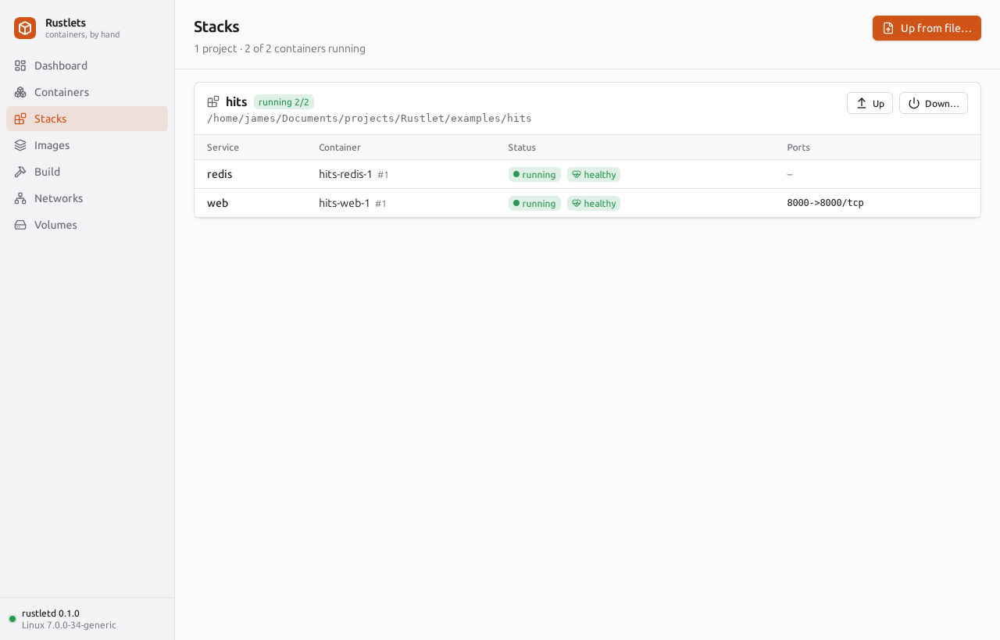

# 19 — Compose and healthchecks: an application in one file

[Chapter 18](18-building-images.md) built the image of `examples/hits`, a
web page that counts its visitors. It keeps the count in Redis, so it
can't run on its own. It needs a Redis container, a network on which the
name `redis` means that container ([chapter 16](16-dns.md)), a volume for
Redis's data ([chapter 12](12-overlayfs.md) §10), a published port
([chapter 15](15-nat-nftables.md)), and an order: Redis first, and the
web app only once Redis answers. By hand that is a network, a volume, two
`run`s and a wait between them. A compose file writes it down once, and
`rustlet compose up` does it. This chapter follows that: what a compose
file may say, how it becomes networks, volumes and containers, how the
daemon decides that a container is healthy, how `up` waits for it, how a
second `up` knows what changed, and how a project is found again later by
a daemon that knows nothing of projects.

Code: the library, [`crates/rustlet-compose/src/`](../../crates/rustlet-compose/src/):
[`model.rs`](../../crates/rustlet-compose/src/model.rs) (`parse`, `service`, `healthcheck`,
`depends_on`, `other_key`), [`interpolate.rs`](../../crates/rustlet-compose/src/interpolate.rs)
(`substitute`, `parse_dotenv`), [`load.rs`](../../crates/rustlet-compose/src/load.rs) (`load`,
`load_selected`, `has_config_file`, `default_files`, `variables`, `merge`
and `rule`, `project_name`, `Context::service`,
`Context::networks`), [`project.rs`](../../crates/rustlet-compose/src/project.rs)
(`Project::startup_order`, `Service::config_hash`, `Service::effective_hash`),
[`run.rs`](../../crates/rustlet-compose/src/run.rs)
(`Compose::up`, `wait_for`, `check`, `converge`, `recreate`, `create`, `labels`, `down`,
`stacks`, `down_project`, `shutdown_order`) and the labels in
[`lib.rs`](../../crates/rustlet-compose/src/lib.rs). The CLI:
[`compose.rs`](../../crates/rustlet-cli/src/compose.rs) (`up`, `EventPrinter`, `LogPrinter`),
the `--health-*` options in [`config.rs`](../../crates/rustlet-cli/src/config.rs) (`healthcheck`),
`ps`'s status in [`format.rs`](../../crates/rustlet-cli/src/format.rs) (`status_text`). The
daemon: [`health.rs`](../../crates/rustletd/src/health.rs) (`HealthPlan::resolve`, `record`,
`start_health`, `check_health`, `run_check`), started in
[`lifecycle.rs`](../../crates/rustletd/src/lifecycle.rs) by `start_shim` and `take_over`,
stopped by `handle_exit`; the options checked in [`spec.rs`](../../crates/rustletd/src/spec.rs)
(`check_healthcheck`). The types: `HealthConfig`, `Health`, `HealthResult` in
[`rustlet-spec/src/container.rs`](../../crates/rustlet-spec/src/container.rs). Tests: 72 unit
tests in `rustlet-compose`'s modules, 24 loading regressions in
[`tests/semantics.rs`](../../crates/rustlet-compose/tests/semantics.rs), and 34 in
[`tests/run.rs`](../../crates/rustlet-compose/tests/run.rs) against a fake daemon, 13 in the CLI's
`compose.rs`, 3 in `health.rs`; against a real daemon, [`compose.rs`](../../tests/tests/compose.rs)
(`cp_`, 3) and [`health.rs`](../../tests/tests/health.rs) (`hc_`, 5), run by `cargo xtask
itest`. The example: [`examples/hits`](../../examples/hits). Design:
[architecture.md §2.6](../architecture.md#26-rustletd--the-daemon) (Healthchecks) and
[§2.9](../architecture.md#29-builder-and-compose) (`rustlet-compose`).

The transcripts were recorded on 2026-10-04, between 06:43 and 07:22 UTC,
against the installed service (`rustletd.service`, this branch's build),
kernel 7.0.0-34-generic, with Redis 7.4.11 and Python 3.14.7 in the
images. The API socket is root's, so every `rustlet` below is really
`sudo target/debug/rustlet`. sudo passes no environment variables on, so
the two commands that set one for the CLI (`TAG=edge`,
`COMPOSE_PROJECT_NAME=fromenv`) ran it through `sudo systemd-run --pipe
--wait -E …`; so did the attached `up` of §7, whose Ctrl-C was a `SIGINT`
from systemd (`KillSignal=SIGINT`, `RuntimeMaxSec=12`). The small projects
of §2 and §5 lived in a scratch directory, `/tmp/claude-1000/ch19`, where
the first `cd` of each of their transcripts starts. Another chapter's
builds ran on the same daemon meanwhile, so the event transcripts keep
only the lines about this chapter's containers. A later fix changed what
a `RUN`'s layer holds, so the build lines of §1's `up` and the image ID
in §3 come from running that `up` again, at 17:58 UTC against commit
`f659ddc`, with chapter 18's build cache.

The explanations below include the 2026-10-05 review fixes. The recorded
transcripts remain from 2026-10-04; their image IDs and config hashes
describe that build.

## 1. Compose is a client

The example is [`examples/hits`](../../examples/hits): `app.py`, the
Containerfile of chapter 18, and this `compose.yaml`:

```yaml
# web counts its visitors in redis; it starts once redis answers PING.
name: hits

services:
  web:
    build: .
    ports:
      - "8000:8000"
    depends_on:
      redis:
        condition: service_healthy
    restart: unless-stopped

  redis:
    image: redis:7-alpine
    healthcheck:
      test: ["CMD", "redis-cli", "ping"]
      interval: 2s
      timeout: 2s
      retries: 5
    volumes:
      - data:/data

volumes:
  data:
```

Two services. `web` is built from this directory, publishes port 8000 and
waits for `redis` to be healthy. `redis` comes from Docker Hub with a
healthcheck of its own, and keeps its data in the volume `data`.

```text
$ cd examples/hits
$ rustlet compose up -d
Network hits_default    Creating
Network hits_default    Created
Volume hits_data        Creating
Volume hits_data        Created
Image hits-web          Building
Sending build context to rustletd  1.9kB
Step 1/9 : FROM python:3-slim
Step 2/9 : WORKDIR /app
Step 3/9 : RUN pip install --no-cache-dir --root-user-action=ignore "redis>=5,<6"
 ---> Using cache
 ---> 74750aeebec3
…
Step 9/9 : CMD ["python", "app.py"]
Successfully built e48844cda9f8
Successfully tagged hits-web:latest
Image hits-web          Built
Container hits-redis-1  Creating
Container hits-redis-1  Created
Container hits-redis-1  Starting
Container hits-redis-1  Started
Container hits-redis-1  Waiting
Container hits-redis-1  Healthy
Container hits-web-1    Creating
Container hits-web-1    Created
Container hits-web-1    Starting
Container hits-web-1    Started
$ curl localhost:8000
Hello from Rustlets! I have been seen 1 times.
$ curl localhost:8000
Hello from Rustlets! I have been seen 2 times.
```

`up` took three seconds, in four steps (`Compose::up` in `run.rs`):

1. **networks**: those the services are on, created if missing. Here
   one, `hits_default`, for the services that name none;
2. **volumes**: the named volumes they mount, `hits_data`;
3. **images**: `hits-web` was missing, so it was built, through the same
   API as `rustlet build` (quickly: the build cache had every step, from
   an earlier build of the same files; a first build runs `pip
   install`). `redis:7-alpine` was there, so nothing was pulled;
4. **services**, in dependency order: `redis` created and started, then a
   wait until its healthcheck said `healthy`, then `web`.

The lines are Compose v2's plain progress (`EventPrinter` in the CLI's
`compose.rs`): a kind, a name padded to the longest the project has, and
what happened to it; a build shows its steps as `rustlet build` does.
They go to stderr, as Compose writes them.

To the daemon these are two containers like any others:

```text
$ rustlet ps
CONTAINER ID   IMAGE            COMMAND                  CREATED         STATUS                   PORTS                    NAMES
4e3200d7b26f   hits-web         "python app.py"          3 seconds ago   Up 3 seconds (healthy)   0.0.0.0:8000->8000/tcp   hits-web-1
8a5603ae4c2f   redis:7-alpine   "docker-entrypoint.s…"   6 seconds ago   Up 6 seconds (healthy)                            hits-redis-1
```

**The daemon knows nothing of projects.** There is no project in
`state.db` and no route for one in the API (chapter 13 §8). `up` made a
network, a volume and two containers with the calls any client can make,
and wrote down whose they are in **labels**:

```text
$ rustlet inspect hits-web-1 | jq '.[0].config.labels'
{
  "io.rustlet.compose.config-hash": "b5c623bf9f95272ce01907597fb54d3bee92d4f74f3587905a5c446555dcc42d",
  "io.rustlet.compose.container-number": "1",
  "io.rustlet.compose.depends-on": "redis:service_healthy:true",
  "io.rustlet.compose.project": "hits",
  "io.rustlet.compose.project.config-files": "/home/james/Documents/projects/Rustlet/examples/hits/compose.yaml",
  "io.rustlet.compose.project.working-dir": "/home/james/Documents/projects/Rustlet/examples/hits",
  "io.rustlet.compose.service": "web"
}
$ rustlet inspect hits_default | jq '.[0] | {name, labels}'
{
  "name": "hits_default",
  "labels": {
    "io.rustlet.compose.network": "default",
    "io.rustlet.compose.project": "hits"
  }
}
$ rustlet inspect hits_data | jq '.[0] | {name, labels}'
{
  "name": "hits_data",
  "labels": {
    "io.rustlet.compose.project": "hits",
    "io.rustlet.compose.volume": "data"
  }
}
```

| label, after `io.rustlet.compose.` | on | says |
|---|---|---|
| `project` | containers, networks, volumes | whose: the project's name |
| `service`, `container-number` | containers | which service, and which of its containers |
| `config-hash` | containers | what the container was made from (§6) |
| `depends-on` | containers | the service's `depends_on`, as `service:condition:required`, so that `down` knows the order without the file (§7) |
| `project.working-dir`, `project.config-files` | containers | where the project lives, for `compose ls` and the desktop app |
| `network`, `volume` | networks, volumes | the key in the file (`default`, `data`) |

The labels are the project's whole state. `compose ps` lists every
container and keeps those labelled `io.rustlet.compose.project=hits`;
`compose ls` groups all containers by that label; `down` finds the
project's networks and volumes the same way. So a project can be taken
down without its file (§5); a container removed behind compose's back is
simply missing at the next `up`, which creates it again; and the CLI and
the desktop app (§8) see the same projects without telling each other
anything. Docker Compose v2 works the same: it is a plugin of the
`docker` CLI, its labels are `com.docker.compose.*`, and dockerd has no
idea what a project is. Here the client side is a library,
`rustlet-compose`, which the CLI and the desktop app both use.

## 2. The compose file

**What it may say.** Rustlets reads a subset of the [Compose
Specification](https://compose-spec.io): the part that maps onto what
`rustlet run`, `network create` and `volume create` already do.

- At the top: `name`, `services`, `networks`, `volumes`.
- In a service: `image`, `build` (`context`, `dockerfile`, `args`,
  `target`, `labels`, `network`, `no_cache`), `command`, `entrypoint`,
  `environment`, `env_file`, `ports`, `volumes`, `tmpfs`, `networks`
  (with `aliases`, `ipv4_address`, `ipv6_address`), `network_mode`,
  `depends_on`, `restart`, `healthcheck`, `user`, `working_dir`,
  `hostname`, `container_name`, `labels`, `tty`, `stdin_open`,
  `read_only`, `privileged`, `cap_add`, `cap_drop`, `security_opt`,
  `devices`, `dns`, `dns_search`, `dns_opt`, `extra_hosts`,
  `stop_signal`, `stop_grace_period`, `mem_limit`, `cpus`, `pids_limit`,
  `deploy` (`replicas`, `resources.limits`), `scale`, `pull_policy`,
  `profiles`.
- In a network: `name`, `external`, `internal`, `enable_ipv6`,
  `ipam.config[].subnet`, `labels` (driver `bridge`). In a volume:
  `name`, `external`, `labels` (driver `local`).

Extension fields (`x-…`) are accepted and ignored wherever Compose takes
them, and so is the obsolete top-level `version`. `expose` is accepted
and ignored with a warning: Rustlets has no `--expose`.

**Anything else is refused, by its path.** The file is walked by hand
(`model.rs`) rather than deserialized with `#[derive(Deserialize)]`, so
that every error says where it is and nothing is dropped in silence. A
file written for Docker Compose may ask for `secrets`, and running
without them would be worse than stopping:

```text
$ cd refuse && cat compose.yaml
services:
  web:
    image: nginx
    secrets: [token]
$ rustlet compose config
rustlet: error: /tmp/claude-1000/ch19/refuse/compose.yaml: services.web.secrets is not supported
$ echo $?
125
```

The same happens to a mount option Rustlets can't honour (`:z`,
`:shared`), a network driver other than `bridge`, `deploy.placement`,
`include`. A value of the wrong shape names its place too
(`services.web.ports[0]: …`). The exit status is 125, as for any failure
of Rustlets' own (chapter 13 §8).

**Variables.** Before anything reads a file, every string value in it
(never a key) has its variables substituted, with the shell's syntax
(`interpolate.rs`):

| written | becomes |
|---|---|
| `$VAR`, `${VAR}` | its value; unset: empty, with a warning |
| `${VAR:-default}` | `default` if `VAR` is unset or empty (`${VAR-default}`: only if unset) |
| `${VAR:?message}` | an error, with `message`, if unset or empty (`${VAR?message}`: if unset) |
| `${VAR:+other}` | `other` if set and not empty, else empty (`${VAR+other}`: if set) |
| `$$` | a `$` |

The variables are the CLI's environment over the project directory's
`.env` file:

```text
$ cd vars && cat compose.yaml .env
name: ch19vars
services:
  app:
    image: alpine:${TAG:-latest}
    command: ["echo", "${GREETING:?put GREETING in .env}"]
    environment:
      LEVEL: ${LEVEL}
      PRICE: $$5
GREETING=hello from .env
TAG=3.20
$ rustlet compose config | jq -c '{name, image: .services[0].image, cmd: .services[0].config.cmd, env: .services[0].config.env, warnings}'
WARN: The "LEVEL" variable is not set. Defaulting to a blank string.
{"name":"ch19vars","image":"alpine:3.20","cmd":["echo","hello from .env"],"env":["LEVEL=","PRICE=$5"],"warnings":["The \"LEVEL\" variable is not set. Defaulting to a blank string."]}
$ TAG=edge rustlet compose config | jq -r '.services[0].image'
alpine:edge
$ cd .. && rustlet compose -f vars/compose.yaml --project-directory . config
rustlet: error: /tmp/claude-1000/ch19/vars/compose.yaml: services.app.command[1]: required variable GREETING is missing a value: put GREETING in .env
```

`.env` said `TAG=3.20`, and the environment's `TAG=edge` won over it.
`LEVEL` was set nowhere: it became empty, with Compose's warning, which
every compose command prints to stderr as it loads the file, and which
the project keeps (`compose config` shows it under `warnings`). With `--project-directory .` there
was no `.env` to read, and `${GREETING:?…}` stopped the load, naming the
file and the place. Since substitution comes first, a variable may stand
where a number or a boolean belongs (`scale: ${N:-1}`): the reader
converts the string by the field's type, as Compose does.

**Several files.** `-f` chooses only the files named, in order. Otherwise,
`COMPOSE_FILE`, from the environment or the project directory's `.env`,
chooses the files: separated by `COMPOSE_PATH_SEPARATOR` (`:` by default),
with relative entries resolved from the current directory. If neither
selects files, Rustlets looks in the project directory for `compose.yaml`,
`compose.yml`, `docker-compose.yaml` and `docker-compose.yml`, in that
order, and takes `compose.override.yaml` (or its other spellings) beside
it as a second file. Parent directories aren't searched; `-f -` is
refused. An invalid `COMPOSE_FILE` entry is an error.

Each file's YAML anchors and `<<` merge keys are resolved, including
nested merges, then its values are interpolated and checked on their own,
so that an error names its file. Each is then merged into those before it
by Compose's rules (`merge` and `rule` in `load.rs`):

- mappings merge key by key; a scalar, or a list not named below, is
  replaced (`command`, `image`, `healthcheck.test`);
- `expose`, `dns`, `dns_search`, `dns_opt`, `tmpfs`, `cap_add`,
  `cap_drop`, `security_opt`, `extra_hosts`, `env_file`, `profiles` and
  each network's `aliases` are concatenated, an item given twice kept once;
- `ports` merge by their normalized host IP, target port, published port
  and protocol: `"8080:80"` and `{target: 80, published: 8080}` are one
  mapping, with default `tcp` and host address accounted for;
- `volumes` and `devices` merge by their path in the container: a later
  entry for `/data` replaces the earlier one, in its place;
- `environment`, `labels` and `build.args`, written as lists or as
  mappings, merge as mappings; so do a service's `networks` and
  `depends_on`. A dependency named again in short syntax resets its
  condition to `service_started` and `required` to true;
- a null field leaves an earlier value alone; a null `environment` entry
  overrides that key (§3). The YAML tags `!reset` (forget what
  the earlier files said) and `!override` (replace rather than merge)
  change that for one key.

```text
$ cd merge && cat compose.yaml compose.override.yaml
name: ch19merge
services:
  web:
    image: nginx
    command: ["nginx", "-g", "daemon off;"]
    ports: ["8080:80"]
    environment:
      MODE: dev
      DEBUG: "1"
services:
  web:
    command: ["nginx-debug", "-g", "daemon off;"]
    ports: ["8443:443"]
    environment:
      MODE: prod
$ rustlet compose config | jq -c '.files, .services[0].config.cmd, .services[0].config.env, [.services[0].config.ports[] | "\(.host_port):\(.container_port)"]'
["/tmp/claude-1000/ch19/merge/compose.yaml","/tmp/claude-1000/ch19/merge/compose.override.yaml"]
["nginx-debug","-g","daemon off;"]
["DEBUG=1","MODE=prod"]
["8080:80","8443:443"]
$ cat reset.yaml
services:
  web:
    ports: !reset []
$ rustlet compose -f compose.yaml -f reset.yaml config | jq -c '.services[0].config.ports'
[]
```

The command was replaced, the environment merged, the ports added up.
With `-f`, the override file wasn't looked for: `reset.yaml` came second,
and its `!reset` took away the base file's ports.

**The project's name** is part of every other name (§3). It is `-p`, else
`COMPOSE_PROJECT_NAME` (from the environment or `.env`), else the file's
`name:`, else the project directory's name: Compose's order. A name
given as such (`-p`, the variable) must already be one once lowercased:
letters, digits, `-` and `_`. One taken from `name:` or from the
directory is made into one, lowercased and with other characters
dropped:

```text
$ cd My_App.2 && cat compose.yaml
services:
  app:
    image: alpine
$ rustlet compose config | jq -r .name
my_app2
$ COMPOSE_PROJECT_NAME=fromenv rustlet compose config | jq -r .name
fromenv
$ rustlet compose -p Shop config | jq -r .name
shop
$ rustlet compose -p 'my shop' config
rustlet: error: invalid project name "my shop" (-p): only letters, digits, '-' and '_', starting with a letter or digit
```

`compose config` prints the project as `up` would make it, every default
applied and every path absolute, as JSON; with `--services`, the
services in the order they start (§5). **Profiles** leave services out:
one with `profiles: [debug]` is included with `--profile debug` or
`COMPOSE_PROFILES=debug` (`*` enables them all). Naming a service on the
command line (`up debug`, `logs debug`, `ps debug`…) also enables its
profiles while loading (`load_selected`). `up debug` targets that service
and its dependencies.

## 3. From services to containers

`load` turns each service into a `ContainerConfig`, the structure that
`rustlet run`'s flags fill, plus what only compose knows: the image's
name and how to build it, the replicas, the dependencies, and the
service's place on each network (`Context::service`):

```text
$ cd examples/hits
$ rustlet compose config --services
redis
web
$ rustlet compose config | jq -c '.services[] | {name, image, depends_on: [.depends_on[] | "\(.service):\(.condition)"], networks: [.networks[] | "\(.network) as \(.aliases | join(","))"], mounts: [.config.mounts[] | "\(.source):\(.target)"]}'
{"name":"web","image":"hits-web","depends_on":["redis:healthy"],"networks":["hits_default as web"],"mounts":[]}
{"name":"redis","image":"redis:7-alpine","depends_on":[],"networks":["hits_default as redis"],"mounts":["hits_data:/data"]}
```

The names follow Compose v2:

| in the file | to the daemon | here |
|---|---|---|
| container `n` of a service | `<project>-<service>-<n>`, or `container_name` (then one container only) | `hits-web-1` |
| the network of the services that name none | `<project>_default` | `hits_default` |
| a network or volume `x` | `<project>_x`, or its `name:`; an `external` one as it is called | `hits_data` |
| a service with `build:` and no `image:` | the image `<project>-<service>` | `hits-web` |

**The command and environment.** An omitted or null `command` inherits
the image's CMD. `command: []` or `command: ""` clears it; a list supplies
the arguments directly, and a string is split into shell words. Clearing
the command changes the config hash too, so `up` recreates a container
that had inherited the image's command.

`env_file` paths are resolved from the project directory and read in
order, with `environment` over their results. Variables in an env file
look first in the project's variables (the shell over `.env`), then in
the service's resolved `environment`, then in earlier lines and files.
A later line can replace an earlier file's value before the next line
interpolates it. Single-quoted values are literal; unquoted and
double-quoted values are interpolated.

A bare `environment` name (`- CLEAR` or `CLEAR: null`) takes the
project's variable if it exists. If unresolved, it removes an earlier
file's value and the image's ENV entry. A bare `CLEAR` in an env file
also removes earlier values when neither the project's variables nor
the service's resolved `environment` supply a value. `CLEAR=` or
`CLEAR: ""` keeps an empty value. This is distinct from
`CLEAR: ${MISSING}`: ordinary YAML interpolation produces an empty string
with a warning (§2).

**The network.** `hits_default` is an ordinary user-defined network: a
bridge, a subnet, and the embedded DNS server of chapter 16. Each service
is on its networks with its own name as an alias, plus any `aliases:` the
file gives. That is all it takes for `app.py` to find `redis`:

```text
$ rustlet network ls
NETWORK ID     NAME           DRIVER    SUBNET
cac3b9f59cd5   bridge         bridge    10.89.0.0/24
f03799987513   hits_default   bridge    10.89.1.0/24
$ rustlet exec hits-web-1 getent hosts redis
10.89.1.2       redis
$ rustlet exec hits-web-1 getent hosts hits-redis-1
10.89.1.2       hits-redis-1
$ rustlet inspect hits-web-1 | jq '.[0].network'
{
  "dns_names": [
    "hits-web-1",
    "4e3200d7b26f",
    "web"
  ],
  "gateway": "10.89.1.1",
  "ip_address": "10.89.1.3",
  …
```

A container's DNS names on a network are its name, its short id, its
hostname (the short id again, here) and its aliases (chapter 16 §5). A
service scaled to three containers (`scale: 3`) has three containers
answering to one alias: chapter 16's round-robin. A service on several
networks is created on the first, with its aliases and addresses there,
and connected to each of the others (`network connect`, with theirs)
before it starts (`Compose::create`), so its program finds all of them
from its first instruction. A service can also be put on the daemon's
default network (`network_mode: bridge`, or `bridge` as an external
network), which has no names (chapter 16 §1): it gets no alias there,
and the loader refuses one.

**The volume.** `data:/data` names the file's volume `data`, which is
`hits_data` to the daemon, created by `up` with the project's labels:

```text
$ rustlet volume ls
DRIVER    VOLUME NAME
local     hits_data
$ rustlet inspect hits-redis-1 | jq '.[0].mounts'
[
  {
    "destination": "/data",
    "name": "hits_data",
    "read_only": false,
    "source": "/var/lib/rustlet/volumes/hits_data/_data",
    "type": "volume"
  }
]
```

In the short syntax the source decides: one starting with `/`, `.` or `~`
is a host path (relative to the project directory, and created if
missing, as Compose does), anything else a volume of the file (one not
declared under `volumes:` is an error), and no source an anonymous
volume.

`up` creates only the networks and named volumes used by the services it
is bringing up. A used `external: true` resource must already exist.
The project retains every top-level declaration, including unused ones
and those used only by inactive profiles, so `down` can protect all
external resources (§7).

**The image.** `build: .` with no `image:` makes the image `hits-web`.
`up` builds it when it is missing, every time with `--build` or
`pull_policy: build`, and never with `--no-build`, which pulls a missing
image instead; `compose build` builds without starting anything. The
build goes to the daemon like `rustlet build`'s: the client packs the
context on a blocking thread as the request sends it, and the progress
comes back as the `Step …` lines of §1. A service with `image:` alone is
pulled when its image is missing (every time with `pull_policy: always`;
with `never`, a missing image is an error). One with both `image:` and
`build:` builds an image of that name. When several selected services use
one image name, `up` chooses a service with `build:` before preparing that
image once; an earlier service with only `image:` therefore cannot skip
the shared build. A build is complete only after the daemon sends its
`Done` event: a stream that ends early fails `up` or `compose build`.
To the daemon it is an image like any other, with its containers:

```text
$ rustlet inspect --type image hits-web | jq -c '.[0] | {id: .id[0:19], containers}'
{"id":"sha256:e48844cda9f8","containers":["hits-web-1"]}
```

## 4. Healthchecks in the daemon

`service_healthy` needs someone to say whether Redis is healthy. In
Docker that is the daemon, and so it is here: a healthcheck belongs to a
container, whoever started it. Compose only reads the verdict.

**Where a check comes from.** From the image's `HEALTHCHECK`, from
`rustlet run`'s options (`--health-cmd`, `--health-interval`,
`--health-timeout`, `--health-start-period`, `--health-start-interval`,
`--health-retries`), or from compose's `healthcheck:`. The last two
become the container's `HealthConfig`, its durations in nanoseconds as
Docker's API and image configs give them. `hits-web`'s check comes from
its Containerfile:

```dockerfile
HEALTHCHECK --interval=5s --timeout=3s --start-period=20s --start-interval=1s \
    CMD ["python", "-c", "import urllib.request; urllib.request.urlopen('http://127.0.0.1:8000/health', timeout=2)"]
```

`/health` answers 200 only when Redis answers `PING`, so `web` is
healthy when it works end to end. The container's settings go over the
image's one by one, as Docker merges them (`HealthPlan::resolve`):
`--health-retries 1` alone keeps the image's command and changes the
retries. A test is `["CMD", program, args…]`, `["CMD-SHELL", command]`
(run by the image's `SHELL`, else `/bin/sh -c`; `--health-cmd` and a
string `test:` are this form), or `["NONE"]`: no check, not even the
image's (`HEALTHCHECK NONE`, `--no-healthcheck`, compose's `disable:
true`). The daemon checks the test's shape, and that each duration is at
least a millisecond, when the container is created (`check_healthcheck`
in `spec.rs`).

**A monitor per run.** When a run of a container with a check starts,
`start_shim` calls `start_health`, which sets the health to `starting`
and spawns a tokio task for the run. A new daemon taking a running
container over (chapter 13 §7) spawns one too, carrying on from the
health saved in `state.db`; its start period still runs from the
container's start (`started_at`), not from the new task's. The run's exit aborts the task
(`handle_exit`). The task is a loop (`check_health`):

1. sleep: the start interval while the start period lasts and the
   container is still `starting`, else the interval;
2. look at the container: running, check it; paused, skip it (its
   processes are frozen, and a check would only time out); anything
   else, the run is ending: stop;
3. run the check, record the result, save the state, and if the verdict
   changed, emit an event.

**A check is an exec through the shim.** `run_check` connects to the
container's `shim.sock` and opens an `Exec` stream, as `rustlet exec`
does (chapter 13 §5), with the check's arguments, as the container's
user and in its environment. It reads stdout and stderr together, keeps
the first 4 KiB, and waits for the shim's `Exited`. If that takes longer
than the timeout, it sends `SIGKILL` down the same stream. The shim kills
the process and reaps it like any other child, so nothing is left
behind. The result is exit code -1, with Docker's words: `Health check
exceeded timeout (1s)`. A check is not one of the daemon's exec
sessions: there is no exec id to inspect and no `exec_create`,
`exec_start` or `exec_die` event. Checks every second would bury
everything else in `rustlet events`.

**Docker's rules make the verdict** (`record`):

- every run starts `starting`;
- exit status 0 is a success: `healthy`, and the count of failures in a
  row (`failing_streak`) goes back to 0;
- anything else (a non-zero status, a timeout, a check that couldn't
  start) is a failure: the streak grows, and when it reaches `retries`
  the container is `unhealthy`;
- while the container is still `starting` and the start period lasts,
  failures don't count. The first success ends that shelter early;
- defaults: interval 30 s, timeout 30 s, start period 0, start interval
  5 s, retries 3. A 0 means the default.

```text
 start ──► starting ──check ok──► healthy ◄──┐
              │                      │ fail   │ ok
              │ `retries` fails      ▼        │
              └────────────────► unhealthy ───┘
```

**The state** is part of the container's (`ContainerState.health`): the
status, the streak, and the last five results with their times, exit
codes and output. It is saved with every check, so `inspect` shows it,
`ps` reads it, and a restarted daemon finds it. When the run ends it
stays as the last checks left it, and the next run starts over at
`starting`. `web` and `redis` a few seconds after `up`:

```text
$ rustlet inspect hits-web-1 | jq '.[0].state.health'
{
  "failing_streak": 0,
  "log": [
    {
      "end": "2026-10-04T06:43:28.086875327Z",
      "exit_code": 0,
      "output": "",
      "start": "2026-10-04T06:43:27.964008246Z"
    },
    {
      "end": "2026-10-04T06:43:33.212789389Z",
      "exit_code": 0,
      "output": "",
      "start": "2026-10-04T06:43:33.091038838Z"
    },
    …
  ],
  "status": "healthy"
}
$ rustlet inspect hits-web-1 | jq '.[0].config.healthcheck'
null
$ rustlet inspect hits-redis-1 | jq '.[0].state.health.log[-1]'
{
  "end": "2026-10-04T06:43:48.223544515Z",
  "exit_code": 0,
  "output": "PONG\n",
  "start": "2026-10-04T06:43:48.168499489Z"
}
```

`web`'s own `healthcheck` is `null`: its check is its image's. The
checks kept are five seconds apart. The start interval of one second
applied only until the first success, and those first checks have
already left the log. Each check starts a new Python, which takes about
120 ms.

**Watching one change.** Stop Redis, and `web`'s `/health` fails. With
`rustlet events --filter container=hits-web-1` running in another
terminal:

```text
$ rustlet stop hits-redis-1
hits-redis-1
$ curl -s -w '%{http_code}\n' localhost:8000
redis: Error -2 connecting to redis:6379. Name or service not known.
503
$ rustlet ps                                         # 20 s later
CONTAINER ID   IMAGE      COMMAND           CREATED              STATUS                          PORTS                    NAMES
4e3200d7b26f   hits-web   "python app.py"   About a minute ago   Up About a minute (unhealthy)   0.0.0.0:8000->8000/tcp   hits-web-1
$ rustlet start hits-redis-1
hits-redis-1
$ curl localhost:8000                                # 7 s later
Hello from Rustlets! I have been seen 3 times.
```

The other terminal:

```text
2026-10-04T06:44:14.229425077Z container health_status 4e3200d7b26f… (health_status=unhealthy, image=hits-web, name=hits-web-1)
2026-10-04T06:44:29.636472037Z container health_status 4e3200d7b26f… (health_status=healthy, image=hits-web, name=hits-web-1)
```

And the checks behind those two events:

```text
$ rustlet inspect hits-web-1 | jq -r '.[0].state.health | "status=\(.status) failing_streak=\(.failing_streak)", (.log[] | "\(.start[11:23])  exit \(.exit_code)  \(.output | rtrimstr("\n") | split("\n") | last // "")")'
status=healthy failing_streak=0
06:44:14.098  exit 1  urllib.error.HTTPError: HTTP Error 503: Service Unavailable
06:44:19.231  exit 1  urllib.error.HTTPError: HTTP Error 503: Service Unavailable
06:44:24.375  exit 1  urllib.error.HTTPError: HTTP Error 503: Service Unavailable
06:44:29.518  exit 0
06:44:34.637  exit 0
```

Even the name `redis` was gone: a stopped container holds no address,
and its names leave the network's DNS zone (chapter 16 §5). The third
failure in a row, twelve seconds after the stop, made `web` unhealthy:
one event. Two more failures changed nothing, so there was no event for
them. The first success after Redis came back made it healthy: one more
event. The count went on at 3 because Redis saved its data to the volume
when it got `SIGTERM` and loaded it when it started again (§7's `logs`
shows both). (A failed check's output is a whole Python traceback; the
`jq` above shows its last line.)

**A verdict is information.** An unhealthy container keeps running.
Neither Docker nor Rustlets restarts it for that: restart policies look
at exits only. Health is for whoever asks: `ps`, the events, the desktop
app, and `up` waiting for a `service_healthy` dependency (§5).

**The start period, from the command line.** Two containers with the
same check, ready four seconds after they start, checked every second,
and unhealthy after a single failure; only `ch19-patient` has a start
period:

```text
$ rustlet run -d --name ch19-patient --health-cmd 'test -e /tmp/ready' --health-interval 1s --health-retries 1 --health-start-period 10s --health-start-interval 1s alpine sh -c 'sleep 4; touch /tmp/ready; exec sleep 600'
decacc4e494af1a22f9062c48614e6a50f51e059d80ee307a078871c0c1c53d7
$ rustlet run -d --name ch19-hasty --health-cmd 'test -e /tmp/ready' --health-interval 1s --health-retries 1 alpine sh -c 'sleep 4; touch /tmp/ready; exec sleep 600'
e2b838d1936e121d48d13639aeba8ae836d90bd8765039d32d2b905c0f985661
$ rustlet ps
CONTAINER ID   IMAGE            COMMAND                  CREATED          STATUS                            PORTS                    NAMES
e2b838d1936e   alpine           "sh -c sleep 4; touc…"   2 seconds ago    Up 2 seconds (unhealthy)                                   ch19-hasty
decacc4e494a   alpine           "sh -c sleep 4; touc…"   2 seconds ago    Up 2 seconds (health: starting)                            ch19-patient
…
```

`rustlet events`, running meanwhile, printed (its `health_status` lines):

```text
2026-10-04T07:11:56.343792945Z container health_status e2b838d1936e… (health_status=unhealthy, image=alpine, name=ch19-hasty)
2026-10-04T07:11:59.364626735Z container health_status decacc4e494a… (health_status=healthy, image=alpine, name=ch19-patient)
2026-10-04T07:11:59.496157410Z container health_status e2b838d1936e… (health_status=healthy, image=alpine, name=ch19-hasty)
```

`ch19-hasty` failed its first check, one second after its start, and was
unhealthy at once. `ch19-patient`'s first checks failed too, but inside
its start period while it was still `starting`, so they didn't count.
Both were healthy at their first success, a little over four seconds in.
`ps` says `health: starting`, not `starting`, which would read as the
container's own state.

**The timeout.** A check that never ends:

```text
$ rustlet run -d --name ch19-stuck --health-cmd 'sleep 5' --health-timeout 1s --health-interval 2s --health-retries 2 alpine sleep 600
6774e03441cde82305100554aeaa5c192e10fdeff96f1ef1610b8498945b513f
$ rustlet inspect ch19-stuck | jq -c '.[0].state.health | {status, failing_streak}'     # 7 s later
{"status":"unhealthy","failing_streak":2}
$ rustlet inspect ch19-stuck | jq -c '.[0].state.health.log[]'
{"end":"2026-10-04T07:12:39.477704264Z","exit_code":-1,"output":"Health check exceeded timeout (1s)","start":"2026-10-04T07:12:38.424357251Z"}
{"end":"2026-10-04T07:12:42.533838020Z","exit_code":-1,"output":"Health check exceeded timeout (1s)","start":"2026-10-04T07:12:41.480728338Z"}
$ rustlet exec ch19-stuck ps -o pid,args
PID   COMMAND
    1 sleep 600
    4 ps -o pid,args
```

The shim also kills an internal healthcheck when its daemon connection
is lost, so a daemon restart cannot leave the old check running beyond
its timeout. User exec sessions retain their normal disconnect behavior.

Each check was killed a second after it started, and no `sleep 5` is
left behind. The next check came two seconds after the last one *ended*:
the interval runs between checks, as in Docker. And no check at all:

```text
$ rustlet run -d --name ch19-quiet --no-healthcheck hits-web >/dev/null
$ rustlet inspect ch19-quiet | jq -c '.[0] | {healthcheck: .config.healthcheck, health: .state.health}'
{"healthcheck":{"interval":null,"retries":null,"start_interval":null,"start_period":null,"test":["NONE"],"timeout":null},"health":null}
$ rustlet run --rm --no-healthcheck --health-interval 1s alpine true
rustlet: error: conflicting options: --no-healthcheck and --health-interval (no healthcheck runs to take options)
$ rustlet ps
CONTAINER ID   IMAGE            COMMAND                  CREATED              STATUS                        PORTS                    NAMES
71d97fd3d248   hits-web         "python app.py"          7 seconds ago        Up 7 seconds                                           ch19-quiet
6774e03441cd   alpine           "sleep 600"              28 seconds ago       Up 28 seconds (unhealthy)                              ch19-stuck
e2b838d1936e   alpine           "sh -c sleep 4; touc…"   About a minute ago   Up About a minute (healthy)                            ch19-hasty
decacc4e494a   alpine           "sh -c sleep 4; touc…"   About a minute ago   Up About a minute (healthy)                            ch19-patient
4e3200d7b26f   hits-web         "python app.py"          29 minutes ago       Up 29 minutes (healthy)       0.0.0.0:8000->8000/tcp   hits-web-1
8a5603ae4c2f   redis:7-alpine   "docker-entrypoint.s…"   29 minutes ago       Up 28 minutes (healthy)                                hits-redis-1
```

`ch19-quiet` runs the `hits-web` image, `HEALTHCHECK` and all, with the
test `["NONE"]` over it: no monitor, no health, nothing after `Up` in
`ps`.

## 5. `depends_on`: who starts first, and who waits

**The order.** `Project::startup_order` sorts the services so that each
comes after everything it depends on: Kahn's algorithm, taking each time
the first service, in the file's order, whose dependencies have all been
placed. Services that don't depend on one another keep the file's order.
Services named on the command line (`compose up web`) bring along
everything they depend on. A cycle is an error that names it. It is
found at load time, so even `compose config` says so:

```text
$ cd cycle && cat compose.yaml
services:
  web:
    image: alpine
    depends_on: [api]
  api:
    image: alpine
    depends_on: [db]
  db:
    image: alpine
    depends_on: [api]
$ rustlet compose config --services
rustlet: error: dependency cycle between services: api -> db -> api
```

**What a dependency must reach** is its `condition`:

- `service_started` (also what the short syntax, `depends_on: [db]`,
  means): started. The order has already done that, so there is nothing
  to wait for;
- `service_healthy`: its healthcheck said `healthy`;
- `service_completed_successfully`: it exited with status 0. This is for
  one-off jobs, such as a migration.

With `required: false`, a dependency that isn't in the project (its
profile is off) is skipped, and one that fails is a warning rather than
an error. `network_mode: service:db` implies `db: service_started`,
since the namespace to join is `db`'s.

**Waiting is polling.** Before it turns to a service, `up` waits for each
of its dependencies in turn (`wait_for`). It asks the daemon about each
of the dependency's containers (`inspect`) every 250 ms, and `check`
decides:

| condition | done | wait | fail |
|---|---|---|---|
| `service_healthy` | `healthy` | `starting`, or no check yet | `unhealthy`; exited; no healthcheck at all (its own or its image's) |
| `service_completed_successfully` | exited with 0 | still running | exited otherwise |

The messages are Compose's, and Compose v2 waits the same way, by asking
the engine again and again. There is no timeout of `up`'s own: a
healthcheck reaches `healthy` or `unhealthy` after a bounded number of
tries, and a container that never exits keeps a
`service_completed_successfully` dependent waiting, as with Compose.

A project with all three:

```text
$ cd deps && cat compose.yaml
name: ch19deps
services:
  web:
    image: alpine
    command: ["sleep", "600"]
    depends_on:
      migrate:
        condition: service_completed_successfully
      cache:
        condition: service_started
  migrate:
    image: alpine
    command: ["sh", "-c", "echo migrating; sleep 1; echo migrated"]
    depends_on:
      db:
        condition: service_healthy
  db:
    image: alpine
    command: ["sh", "-c", "sleep 2; touch /tmp/ready; exec sleep 600"]
    healthcheck:
      test: ["CMD", "test", "-e", "/tmp/ready"]
      interval: 1s
      retries: 3
  cache:
    image: alpine
    command: ["sleep", "600"]
$ rustlet compose config --services
db
migrate
cache
web
$ rustlet compose up -d
Network ch19deps_default      Creating
Network ch19deps_default      Created
Container ch19deps-db-1       Creating
Container ch19deps-db-1       Created
Container ch19deps-db-1       Starting
Container ch19deps-db-1       Started
Container ch19deps-db-1       Waiting
Container ch19deps-db-1       Healthy
Container ch19deps-migrate-1  Creating
Container ch19deps-migrate-1  Created
Container ch19deps-migrate-1  Starting
Container ch19deps-migrate-1  Started
Container ch19deps-cache-1    Creating
Container ch19deps-cache-1    Created
Container ch19deps-cache-1    Starting
Container ch19deps-cache-1    Started
Container ch19deps-migrate-1  Waiting
Container ch19deps-migrate-1  Exited
Container ch19deps-web-1      Creating
Container ch19deps-web-1      Created
Container ch19deps-web-1      Starting
Container ch19deps-web-1      Started
$ rustlet compose ps -a
NAME                 IMAGE     COMMAND                  SERVICE   CREATED                  STATUS                              PORTS
ch19deps-cache-1     alpine    "sleep 600"              cache     1 second ago             Up 1 second
ch19deps-db-1        alpine    "sh -c sleep 2; touc…"   db        3 seconds ago            Up 3 seconds (healthy)
ch19deps-migrate-1   alpine    "sh -c echo migratin…"   migrate   1 second ago             Exited (0) Less than a second ago
ch19deps-web-1       alpine    "sleep 600"              web       Less than a second ago   Up Less than a second
```

The order is `db`, `migrate`, `cache`, `web`: `web` comes first in the
file but depends on two others, and `migrate` must wait for `db`. Before
`migrate`, `up` waited for `db` to be healthy (three seconds: the first
check after `touch`). `cache` started while `migrate` ran. When `web`'s
turn came, `up` waited for `migrate` to exit with 0, and didn't wait for
`cache` at all: `service_started` was already true. The whole `up` took
four seconds.

**When a dependency fails.** The same project, with an override in which
`db` never becomes ready:

```text
$ cat sick.yaml
services:
  db:
    command: ["sleep", "600"]
$ rustlet compose -p ch19sick -f compose.yaml -f sick.yaml up -d
Network ch19sick_default      Creating
Network ch19sick_default      Created
Container ch19sick-db-1       Creating
Container ch19sick-db-1       Created
Container ch19sick-db-1       Starting
Container ch19sick-db-1       Started
Container ch19sick-db-1       Waiting
rustlet: error: dependency failed to start: container ch19sick-db-1 is unhealthy
$ echo $?
125
$ rustlet compose -p ch19sick -f compose.yaml -f sick.yaml ps -a
NAME            IMAGE     COMMAND       SERVICE   CREATED         STATUS                     PORTS
ch19sick-db-1   alpine    "sleep 600"   db        3 seconds ago   Up 3 seconds (unhealthy)
```

Three failed checks, a second apart, and `up` gave up with Compose's
message. Nothing that depends on `db` was created. Neither was `cache`,
which doesn't: Rustlets starts the services one at a time, in the order
above, and the failed wait stopped `up` before `cache`'s turn. Compose
starts independent services in parallel, so it would have started
`cache` while it waited for `db`. What `up` made stays, for you to look
at. The project is taken down by its name alone, from a directory with
no compose file in it:

```text
$ cd /tmp/claude-1000/ch19 && rustlet compose -p ch19sick down
Container ch19sick-db-1  Stopping
Container ch19sick-db-1  Stopped
Container ch19sick-db-1  Removing
Container ch19sick-db-1  Removed
Network ch19sick_default  Removing
Network ch19sick_default  Removed
```

Without a file there is nothing to line the names up by, hence the
ragged columns. Everything `down` needed, it found in the labels
(`down_project`).

That fallback requires both `-p` and no file selected by `-f`,
`COMPOSE_FILE`/`.env`, or default discovery. Selected files are loaded
before teardown; an invalid selection is an error. The given project
name is validated and lowercased just as it is for `up`, so `-p SHOP`
targets `shop` in either case.

## 6. `up` again: what changed?

`up` **converges**: it makes the daemon's containers what the file says,
whatever is there already (`converge`). For each container number of a
service:

- missing: created and started;
- there, labelled with the service's current **config hash**, and
  running the current **image**: left as it is (started if it was
  stopped);
- there but different: **recreated**, which means stopped, removed,
  created again under the same name, and started;
- numbered above the replicas: removed, highest first.

The hash (`Service::config_hash`) is the SHA-256 of the service's
container config, its image's name, its `container_name` and its
networks, written as canonical JSON (keys sorted, no blanks), so that the
order in which the file wrote them doesn't matter. It leaves out what
changes no container: the number of replicas, `depends_on`, and how the
image is made (`build`, `pull_policy`). The image is compared by its ID,
so a rebuilt image recreates the containers that ran the old one. For
`network_mode: service:db`, the effective hash also holds `db`'s current
first container ID. Recreating `db` therefore recreates its namespace
sharers, which must join the new namespace. Run `up` again, unchanged:

```text
$ rustlet compose up -d
Network hits_default    Running
Volume hits_data        Running
Container hits-redis-1  Running
Container hits-redis-1  Waiting
Container hits-redis-1  Healthy
Container hits-web-1    Running
$ rustlet inspect hits-web-1 hits-redis-1 | jq -r '.[] | "\(.name)  \(.config.labels["io.rustlet.compose.config-hash"][0:16])…  \(.id[0:12])"'
hits-web-1  b5c623bf9f95272c…  4e3200d7b26f
hits-redis-1  78981fb2b5c245ef…  8a5603ae4c2f
```

Nothing to do, except `web`'s wait for `redis`, which was healthy
already. Now change `web`, with a second file:

```text
$ cat /tmp/claude-1000/ch19/debug.yaml
services:
  web:
    environment:
      LOG_LEVEL: debug
$ rustlet compose -f compose.yaml -f /tmp/claude-1000/ch19/debug.yaml up -d
Network hits_default    Running
Volume hits_data        Running
Container hits-redis-1  Running
Container hits-redis-1  Waiting
Container hits-redis-1  Healthy
Container hits-web-1    Recreating
Container hits-web-1    Recreated
Container hits-web-1    Starting
Container hits-web-1    Started
$ rustlet inspect hits-web-1 hits-redis-1 | jq -r '.[] | "\(.name)  \(.config.labels["io.rustlet.compose.config-hash"][0:16])…  \(.id[0:12])"'
hits-web-1  ea1e5878fa227b14…  924fc7ad844a
hits-redis-1  78981fb2b5c245ef…  8a5603ae4c2f
$ rustlet compose ps
NAME           IMAGE            COMMAND                  SERVICE   CREATED                  STATUS                                     PORTS
hits-redis-1   redis:7-alpine   "docker-entrypoint.s…"   redis     32 minutes ago           Up 31 minutes (healthy)
hits-web-1     hits-web         "python app.py"          web       Less than a second ago   Up Less than a second (health: starting)   0.0.0.0:8000->8000/tcp
```

One variable more, a new hash, a new `hits-web-1`; `redis`, its hash and
its container untouched. The recreate took ten seconds. `python app.py`
is PID 1 of its container and has no handler for `SIGTERM`, so the
signal was ignored (chapter 13 §6), and the stop ended in `SIGKILL` after
the default timeout: the old container's `die` event said
`exit_code=137`. A plain `up` afterwards, without `debug.yaml`, recreated
`web` once more, and its hash was `b5c623bf9f95272c…` again: the hash is
a function of the service, not a record of what was there.

The flags change the rules: `--force-recreate` recreates unchanged
containers of the services named (all services when none are named);
`--always-recreate-deps` also recreates the dependencies brought along.
`--no-recreate` never recreates and conflicts with either flag. `--build`
builds the images first even if they exist, and `--remove-orphans` removes the
containers of services the file no longer has (without it, `up` warns
about them in Compose's words). A recreated container gets new anonymous
volumes. The old container's are left behind, unused, where Compose
would hand them to the new one.

The old container is removed before its replacement is created. If the
daemon refuses the replacement, that service has no container until a
successful `up`. Compose creates the replacement under a temporary name
first; Rustlets' daemon has no rename or configuration preflight API.

## 7. `ps`, `logs`, `stop`, `start`, `ls`, `down`

`ps` is the project's containers in Compose v2's columns, `logs` their
output merged:

```text
$ rustlet compose ps
NAME           IMAGE            COMMAND                  SERVICE   CREATED          STATUS                    PORTS
hits-redis-1   redis:7-alpine   "docker-entrypoint.s…"   redis     34 minutes ago   Up 33 minutes (healthy)
hits-web-1     hits-web         "python app.py"          web       6 seconds ago    Up 6 seconds (healthy)    0.0.0.0:8000->8000/tcp
$ rustlet compose logs
redis-1  | 1:C 04 Oct 2026 06:43:19.460 # WARNING Memory overcommit must be enabled! Without it, a background save or replication may fail …
redis-1  | 1:C 04 Oct 2026 06:43:19.460 * oO0OoO0OoO0Oo Redis is starting oO0OoO0OoO0Oo
…
redis-1  | 1:M 04 Oct 2026 06:43:19.462 * Ready to accept connections tcp
redis-1  | 1:signal-handler (1791096241) Received SIGTERM scheduling shutdown...
redis-1  | 1:M 04 Oct 2026 06:44:01.833 * User requested shutdown...
redis-1  | 1:M 04 Oct 2026 06:44:01.833 * Saving the final RDB snapshot before exiting.
redis-1  | 1:M 04 Oct 2026 06:44:01.836 * DB saved on disk
redis-1  | 1:M 04 Oct 2026 06:44:01.836 # Redis is now ready to exit, bye bye...
…
redis-1  | 1:M 04 Oct 2026 06:44:26.133 * Loading RDB produced by version 7.4.11
…
redis-1  | 1:M 04 Oct 2026 06:44:26.134 * Done loading RDB, keys loaded: 1, keys expired: 0.
redis-1  | 1:M 04 Oct 2026 06:44:26.134 * DB loaded from disk: 0.000 seconds
redis-1  | 1:M 04 Oct 2026 06:44:26.134 * Ready to accept connections tcp
web-1    | serving on :8000
web-1    | 127.0.0.1 "GET /health HTTP/1.1" 200 -
web-1    | 127.0.0.1 "GET /health HTTP/1.1" 200 -
web-1    | 10.89.1.1 "GET / HTTP/1.1" 200 -
$ rustlet compose logs -n 2
redis-1  | 1:M 04 Oct 2026 06:44:26.134 * DB loaded from disk: 0.000 seconds
redis-1  | 1:M 04 Oct 2026 06:44:26.134 * Ready to accept connections tcp
web-1    | 127.0.0.1 "GET /health HTTP/1.1" 200 -
web-1    | 10.89.1.1 "GET / HTTP/1.1" 200 -
```

Each line carries its container's name, less the project's (`web-1`),
padded so that the lines start in one column, then ` | `; on a terminal
each container gets a colour. A line goes to the stream it was printed
on. Without `-f` the lines of all containers are sorted by their time,
so the stop and start of §4 appear where they happened; with `-f` they
come as they are written. `-n 2` is two lines from the end of each
container's log. The health checks come from `127.0.0.1`, inside the
container. The `curl` comes from `10.89.1.1`, the host's address on the
bridge: a connection to `localhost:8000` can't be DNATed, so the
daemon's proxy relayed it (chapter 15 §5). (`web`'s log starts at its
recreation in §6: a new container has a new log.)

**Stop and start** go in dependency order: dependents first when
stopping, and the other way round, with the waits, when starting:

```text
$ rustlet compose stop
Container hits-web-1    Stopping
Container hits-web-1    Stopped
Container hits-redis-1  Stopping
Container hits-redis-1  Stopped
$ rustlet compose ps -a
NAME           IMAGE            COMMAND                  SERVICE   CREATED          STATUS                                PORTS
hits-redis-1   redis:7-alpine   "docker-entrypoint.s…"   redis     34 minutes ago   Exited (0) Less than a second ago
hits-web-1     hits-web         "python app.py"          web       21 seconds ago   Exited (137) Less than a second ago
$ rustlet compose ls
NAME      STATUS    CONFIG FILES
$ rustlet compose ls -a
NAME      STATUS      CONFIG FILES
hits      exited(2)   /home/james/Documents/projects/Rustlet/examples/hits/compose.yaml
$ rustlet compose start
Container hits-redis-1  Starting
Container hits-redis-1  Started
Container hits-redis-1  Waiting
Container hits-redis-1  Healthy
Container hits-web-1    Starting
Container hits-web-1    Started
$ rustlet compose ls
NAME      STATUS       CONFIG FILES
hits      running(2)   /home/james/Documents/projects/Rustlet/examples/hits/compose.yaml
```

The stop took ten seconds, for §6's reason: `web` was killed (137),
`redis` exited 0 after saving its data. `web` has `restart:
unless-stopped`, and a stop is a stop by hand, which restart policies
leave alone (chapter 13 §6). `compose ls` (`stacks` in `run.rs`) groups
the daemon's containers by their project label: without `-a`, only the
projects with something running, counted by state.

**Down** removes what `up` made, dependents first: the containers in the
reverse of the startup order, then the networks labelled as the
project's, and with `-v` the volumes labelled as the project's and the
containers' anonymous volumes. Every network or volume the file declares
external stays, even if it carries this project's label from an earlier
configuration, is unused now, or is used only by an inactive-profile
service. `--rmi local` also removes the images built for
services without `image:`, `--rmi all` every service's image;
`--remove-orphans`, the containers of services the file no longer has.
`-t` is each container's stop timeout:

```text
$ rustlet compose down -v
Container hits-web-1    Stopping
Container hits-web-1    Stopped
Container hits-web-1    Removing
Container hits-web-1    Removed
Container hits-redis-1  Stopping
Container hits-redis-1  Stopped
Container hits-redis-1  Removing
Container hits-redis-1  Removed
Network hits_default    Removing
Network hits_default    Removed
Volume hits_data        Removing
Volume hits_data        Removed
$ cd /tmp/claude-1000/ch19/deps && rustlet compose down -t 1
Container ch19deps-web-1      Stopping
Container ch19deps-web-1      Stopped
Container ch19deps-web-1      Removing
Container ch19deps-web-1      Removed
Container ch19deps-cache-1    Stopping
Container ch19deps-cache-1    Stopped
Container ch19deps-cache-1    Removing
Container ch19deps-cache-1    Removed
Container ch19deps-migrate-1  Removing
Container ch19deps-migrate-1  Removed
Container ch19deps-db-1       Stopping
Container ch19deps-db-1       Stopped
Container ch19deps-db-1       Removing
Container ch19deps-db-1       Removed
Network ch19deps_default      Removing
Network ch19deps_default      Removed
```

`ch19deps` went down `web`, `cache`, `migrate`, `db`: §5's order
backwards. (Its `sleep`s are PID 1 without a handler for `SIGTERM`
either, hence `-t 1`.) With no file, as for `ch19sick` in §5, the order
comes from the containers' `depends-on` labels (`shutdown_order`): a
service nothing left depends on goes first.

**`up` without `-d`** stays in the foreground and follows the output of
the services' containers, from the moment it began, until they have all
exited. Ctrl-C stops them, dependents first, and `up` exits with 130; a
second Ctrl-C kills them:

```text
$ rustlet compose up
Network hits_default    Creating
…
Container hits-web-1    Started
redis-1  | 1:C 04 Oct 2026 07:22:01.830 # WARNING Memory overcommit must be enabled! Without it, a background save or replication may fail …
redis-1  | 1:C 04 Oct 2026 07:22:01.830 * oO0OoO0OoO0Oo Redis is starting oO0OoO0OoO0Oo
…
redis-1  | 1:M 04 Oct 2026 07:22:01.831 * Ready to accept connections tcp
web-1    | serving on :8000
web-1    | 127.0.0.1 "GET /health HTTP/1.1" 200 -
web-1    | 10.89.1.1 "GET / HTTP/1.1" 200 -
web-1    | 127.0.0.1 "GET /health HTTP/1.1" 200 -
Gracefully stopping... (press Ctrl+C again to force)        ← SIGINT
Container hits-web-1    Stopping
web-1    | 127.0.0.1 "GET /health HTTP/1.1" 200 -
web-1    | 127.0.0.1 "GET /health HTTP/1.1" 200 -
Container hits-web-1    Stopped
Container hits-redis-1  Stopping
redis-1  | 1:signal-handler (1791098543) Received SIGTERM scheduling shutdown...
redis-1  | 1:M 04 Oct 2026 07:22:23.648 * User requested shutdown...
Container hits-redis-1  Stopped
```

The checks went on while `web` took its ten seconds to stop: until it
exits, it is running. The containers stay, stopped; `down` removes them.

## 8. Stacks in the desktop app

The desktop app ([chapter 17](17-tauri-ipc.md)) shows compose projects
in its **Stacks** view
([`StacksPage.tsx`](../../desktop/src/views/stacks/StacksPage.tsx); the
commands in [`compose.rs`](../../desktop/src-tauri/src/compose.rs)). It
uses the same library as the CLI, so it has the same idea of a project.
Its list is `rustlet_compose::stacks`, which `compose ls` uses too: every
project the daemon has containers of, found by their labels, with each
service's containers, their state, health and ports. Every container
event but an exec's, `health_status` among them, refreshes it (chapter 17
§6), so a service turning healthy, or a project the CLI takes down, shows
at once. *Down* is `down_project`, by the project's name alone, like
`compose -p NAME down`, and removes its volumes too if asked. *Up* brings
a project up again from the files its `project.config-files` label names,
in its `project.working-dir`; *Up from file* takes a compose file's path.
Both run `Compose::up` in a task of their own, as `rustlet compose up -d`
would, and stream its progress to the window over a channel (chapter 17
§5). The file's `${VAR}`s read the app's environment, a launcher's rather
than your shell's.



The card is the project; its rows are the services' containers, with the
container number (`#1`), state, health and published ports that `compose
ps` shows. The path under the name is the `project.working-dir` label:
*Up* starts there.

## 9. Differences from Docker Compose

- **One service at a time.** `up` creates and starts the services one
  after another, in the order of §5; Compose starts independent services
  in parallel. A dependency that fails therefore also stops services
  later in the order that don't depend on it (`cache` in §5).
- **A subset, and the rest refused.** Keys outside §2's list (`secrets`,
  `configs`, `include`, `extends`, `logging`, `ulimits`, `init`…) and
  options Rustlets can't honour (`:z`, `:shared`, other drivers) stop the
  load with their path. `expose`, `x-…` and `version` are accepted and
  ignored, and so is `depends_on`'s `restart: true`, with which Compose
  restarts a service when its dependency is recreated.
- **Fewer commands.** `up`, `down`, `ps`, `logs`, `build`, `stop`,
  `start`, `ls` and `config`, and none of Compose's others (`run`,
  `exec`, `restart`, `pull`, `rm`, `kill`, `pause`, `top`, `events`,
  `watch`…); no `up --wait`, `--scale` or `--abort-on-container-exit`.
  `rustlet exec hits-web-1 …` does what `compose exec web …` would.
- **Files.** Parent directories aren't searched for the compose file, and
  there is no `--env-file` or `-f -`. Warnings found while loading (unset
  variables, `version`, `expose`) are printed as `WARN: …` lines, where
  Compose prints `WARN[0000] …`.
- **`config` prints JSON**: the project as Rustlets reads it,
  normalized, rather than Compose's canonical YAML.
- **Recreated containers get new anonymous volumes**; Compose hands them
  the old container's (unless `-V`).
- **Old containers are removed before replacement.** A rejected replacement
  leaves its service without a container; Compose uses a temporary name
  and renames the replacement (§6).
- **`logs` without `-f` is sorted by time** across containers; Compose
  prints each container's lines as it reads them.
- **Images.** A service with `build:` is pulled only when its image is
  missing and building isn't allowed (`--no-build`), never to look for a
  newer one.
- **Healthchecks.** Docker runs each check as an exec of its own, with
  `exec_create`, `exec_start` and `exec_die` events every time; Rustlets'
  checks make no exec session and no exec events. The verdict's event is
  the action `health_status` with the verdict as an attribute
  (`health_status=healthy`); Docker's action is `health_status:
  healthy`.

## 10. Try it

From the repository, with the daemon installed (chapter 13):

```sh
R="sudo target/debug/rustlet"
C="$R compose -f examples/hits/compose.yaml"
$C config --services                         # redis, then web
$C up -d                                     # network, volume, build, redis, wait, web
curl localhost:8000; curl localhost:8000     # 1 times, 2 times
$C ps; $C logs -n 3
$R inspect hits-web-1 | jq '.[0].config.labels, .[0].state.health.status'
# in another terminal: sudo target/debug/rustlet events --filter container=hits-web-1
$R stop hits-redis-1; sleep 20; $R ps        # hits-web-1: (unhealthy)
$R start hits-redis-1; sleep 7; curl localhost:8000
$C up -d                                     # nothing to do: every container Running
$C stop && $C start                          # web first, then redis; redis first, then web
$C down -v
cargo xtask itest -- cp_ hc_                 # the tests behind this chapter
```

## Check yourself

1. The daemon has no notion of a project. How does `rustlet compose ps`
   find the project's containers, and what does `compose -p hits down`
   need besides the daemon?
   *By label: it lists every container and keeps those whose
   `io.rustlet.compose.project` is `hits`. With no selected compose file,
   `down` needs only the project name: networks and volumes carry the
   label too, and `depends-on` gives the order. With a selected file, it
   also loads its declarations, including the external resources to
   keep.*
2. Why can `app.py` connect to `redis` with no address anywhere in the
   file, and why would that fail on the daemon's default network?
   *Every service is on `hits_default` with its name as an alias, and
   the network's embedded DNS server answers it. The default `bridge`
   network has no names (chapter 16), so the loader refuses aliases
   there.*
3. `TAG` is `3.20` in `.env` and `edge` in your shell. Which does
   `image: alpine:${TAG:-latest}` get, and when would it get `latest`?
   *`edge`: the environment goes over `.env`. `latest` when `TAG` is
   unset or empty in both.*
4. You run `compose up -d` twice. What tells the second run to leave the
   containers alone? Name two changes to `web` that would recreate it,
   and two that wouldn't.
   *The `config-hash` label, compared with the hash of the service now,
   and the image's ID. An environment variable or a port would; the
   number of replicas or its `depends_on` wouldn't.*
5. In `ch19sick`, why was `cache` never created, though it depends on
   nothing? What would Compose have done?
   *`up` goes one service at a time in the order `db`, `migrate`,
   `cache`, `web`, and stopped when the wait for `db` failed. Compose
   starts independent services in parallel, so `cache` would have
   started.*
6. A check runs for four seconds with `--health-timeout 1s`. What does
   its log entry say, what happens to the process, and does it count?
   *Exit code -1, "Health check exceeded timeout (1s)". The daemon sends
   `SIGKILL` through the exec stream, and the shim reaps the process. It
   is a failure, unless the container is still starting within its start
   period.*
7. `ch19-hasty` and `ch19-patient` ran the same check. Why was one
   unhealthy for three seconds and the other never?
   *Both had `retries` 1. Only `ch19-patient` had a start period, during
   which failures don't count while the container is still `starting`.
   Both became healthy at their first success.*
8. Why are checks execs through the shim but not exec sessions? What
   would `rustlet events` look like otherwise?
   *A session is an API object with an id and events of its own; a check
   every second would add three events a second per container. Only a
   change of verdict is news, as `health_status`.*
9. After `compose stop`, `web` said `Exited (137)` and `redis` `Exited
   (0)`. Why the difference, and why did the stop take ten seconds?
   *`python app.py` is PID 1 with no `SIGTERM` handler, so the signal was
   ignored, and the daemon killed it after the 10 s timeout: 128 + 9.
   Redis handles `SIGTERM`, saves, and exits 0.*
10. A service depends on `db` with `service_healthy`, and `db`'s image
    has no `HEALTHCHECK`. What does `up` do?
    *It fails at once: "dependency failed to start: container … has no
    healthcheck configured". It looked for a check of the container's
    own, then its image's.*

## Experiments

- **Scale and the alias.** In a project of your own, give an alpine
  `web` service `scale: 3` (`command: ["sleep", "600"]`) and add a
  `client` service. Run `getent hosts web` in the client a few times.
  Then set `scale: 1` and `up` again: which containers go, and why are
  the others neither recreated nor restarted?
- **What is in the hash.** Change only `web`'s `depends_on` and run `up`;
  then change only its `restart:`. Which change recreates it? Check
  `Service::config_hash` for why.
- **A dependency that exits.** Give `db` a healthcheck and `command:
  ["false"]`, with a `service_healthy` dependent; then `command: ["sh",
  "-c", "exit 3"]` with a `service_completed_successfully` one. What does
  `up` say each time, and how long does it wait?
- **Pause.** Run a container with a one-second check, `rustlet pause` it,
  and watch `inspect`'s health log while it is paused, and `ps`. What
  happens to the checks? Unpause it and look again.
- **A restart in the start period.** Run `rustlet run -d --name sp
  --health-cmd false --health-interval 1s --health-retries 1
  --health-start-period 60s alpine sleep 600`, restart the daemon after
  thirty seconds (`sudo systemctl restart rustletd`), and note when `sp`
  turns unhealthy: sixty seconds after its start, or after the restart?
  Find where `check_health` gets the start from.
- **Merging by hand.** Write an override with `environment: !override
  {ONLY: "1"}` for one service, and another with `ports: !reset []`.
  Predict `compose config`'s output for each order of the two files,
  then check.
